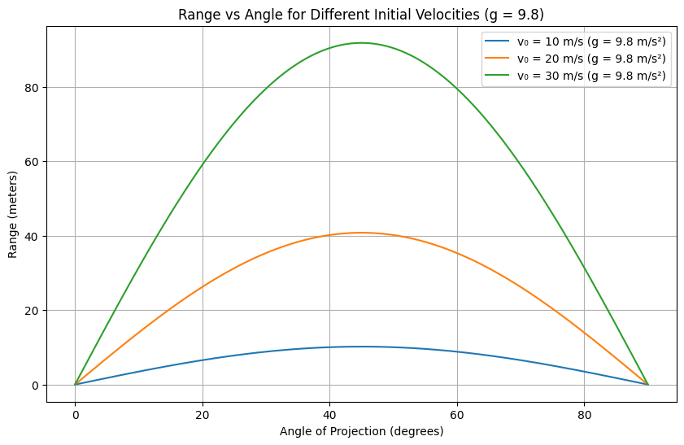
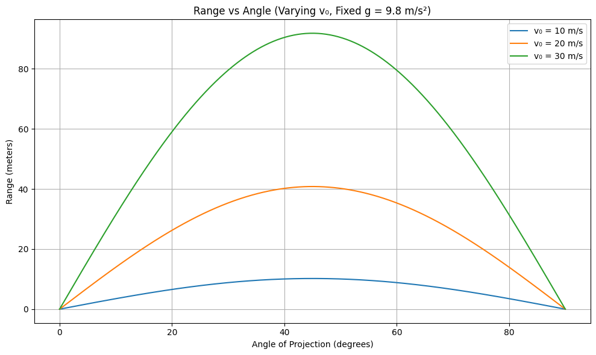

# Problem 1
#  Investigating the Range as a Function of the Angle of Projection  
##  Task 1: Theoretical Foundation

###  Objective:
To derive the governing equations of projectile motion from first principles and understand how variations in initial conditions lead to a family of solutions.

---

###  Fundamental Principles

We begin with **Newton’s Second Law of Motion** applied to two-dimensional projectile motion under gravity:

- The only force acting on the object (ignoring air resistance) is gravity.
- Acceleration due to gravity is constant and acts downward with magnitude $g$.

Let the object be projected with an initial velocity $v_0$ at an angle $\theta$ to the horizontal.

---

###  Equations of Motion

We split the motion into **horizontal (x)** and **vertical (y)** components.

- Horizontal acceleration: $a_x = 0$
- Vertical acceleration: $a_y = -g$

Initial velocity components:
- $v_{0x} = v_0 \cos(\theta)$
- $v_{0y} = v_0 \sin(\theta)$

Using basic kinematic equations:

#### Horizontal Motion:
$$
x(t) = v_0 \cos(\theta) \cdot t
$$

#### Vertical Motion:
$$
y(t) = v_0 \sin(\theta) \cdot t - \frac{1}{2} g t^2
$$

---

###  Time of Flight

The projectile returns to the same vertical level when $y(t) = 0$ (assuming it lands at the same height it was launched):

$$
0 = v_0 \sin(\theta) \cdot t - \frac{1}{2} g t^2
$$

Factor out $t$:
$$
t \left( v_0 \sin(\theta) - \frac{1}{2} g t \right) = 0
$$

Ignoring the trivial solution $t = 0$, we get:
$$
t = \frac{2 v_0 \sin(\theta)}{g}
$$

---

### Range of the Projectile

To find the horizontal **range $R$**, substitute the total time of flight into $x(t)$:

$$
R = v_0 \cos(\theta) \cdot \frac{2 v_0 \sin(\theta)}{g}
$$

Using the identity $\sin(2\theta) = 2 \sin(\theta) \cos(\theta)$:

$$
R(\theta) = \frac{v_0^2 \sin(2\theta)}{g}
$$

---

### Family of Solutions

The above equation defines a **family of parabolic trajectories**, each determined by a specific launch angle $\theta$ and initial velocity $v_0$. For a fixed $v_0$:

- As $\theta$ varies, so does the range $R(\theta)$.
- Maximum range occurs at $\theta = 45^\circ$, where $\sin(2\theta) = 1$.
- Pairs of angles $(\theta, 90^\circ - \theta)$ give the same range due to the symmetry of the sine function.

---

###  Summary of Governing Equations:

- **Horizontal motion**: $x(t) = v_0 \cos(\theta) \cdot t$
- **Vertical motion**: $y(t) = v_0 \sin(\theta) \cdot t - \frac{1}{2} g t^2$
- **Time of flight**: $T = \frac{2 v_0 \sin(\theta)}{g}$
- **Range**: $R(\theta) = \frac{v_0^2 \sin(2\theta)}{g}$

---

#  Task 2: Analysis of the Range

###  Objective:
To investigate how the **horizontal range** of a projectile depends on the **angle of projection** and how variations in **initial velocity** ($v_0$) and **gravitational acceleration** ($g$) influence this relationship.

---

###  Recap: Range Equation

From Task 1, we derived the horizontal range of a projectile as:

$$
R(\theta) = \frac{v_0^2 \sin(2\theta)}{g}
$$

This formula clearly shows that the range:
- Depends on $\sin(2\theta)$, which peaks at $2\theta = 90^\circ$ → $\theta = 45^\circ$.
- Is directly proportional to the square of the initial velocity $v_0$.
- Is inversely proportional to gravitational acceleration $g$.

---

###  Python Simulation

Below is a Python script to visualize how the range varies with projection angle for different values of $v_0$ and $g$.

```python
import numpy as np
import matplotlib.pyplot as plt

def compute_range(theta_deg, v0, g):
    theta_rad = np.radians(theta_deg)
    return (v0 ** 2) * np.sin(2 * theta_rad) / g

angles = np.linspace(0, 90, 500)

# Parameters for comparison
v0_values = [10, 20, 30]
g_values = [9.8, 1.6, 24.8]  # Earth, Moon, Jupiter

plt.figure(figsize=(10, 6))

# Plot for different initial velocities on Earth
for v0 in v0_values:
    ranges = compute_range(angles, v0, 9.8)
    plt.plot(angles, ranges, label=f'v₀ = {v0} m/s (g = 9.8 m/s²)')

plt.xlabel('Angle of Projection (degrees)')
plt.ylabel('Range (meters)')
plt.title('Range vs Angle for Different Initial Velocities (g = 9.8)')
plt.legend()
plt.grid(True)
plt.show()

# Plot for different gravity environments (fixed v0)
plt.figure(figsize=(10, 6))
v0_fixed = 20
for g in g_values:
    ranges = compute_range(angles, v0_fixed, g)
    plt.plot(angles, ranges, label=f'g = {g} m/s²')

plt.xlabel('Angle of Projection (degrees)')
plt.ylabel('Range (meters)')
plt.title(f'Range vs Angle for Different Gravity (v₀ = {v0_fixed} m/s)')
plt.legend()
plt.grid(True)
plt.show()
```


#  Task 3: Practical Applications

###  Objective:
To explore how the ideal projectile motion model can be adapted for **real-world situations**, including **uneven terrain** and the presence of **air resistance**.

---

###  Revisiting the Ideal Model

The basic model we previously used assumed:
- No air resistance.
- Flat, level ground.
- Constant gravitational acceleration.
- Point-mass projectile.

However, real-world conditions often violate these assumptions. To make our model more applicable, we need to introduce more complexity step by step.

---

###  1. Uneven Terrain

#### Scenario:
- The projectile is launched from or lands on a hill, slope, or building.
- Launch and landing heights are different: $y_0 \neq 0$.

#### Modified Equation for Range:

If the landing height is different, we must solve for the time $t$ when $y(t) = y_{\text{final}}$, then compute:

$$
R = x(t) = v_0 \cos(\theta) \cdot t
$$

This requires solving the quadratic:

$$
y_{\text{final}} = v_0 \sin(\theta) \cdot t - \frac{1}{2} g t^2 + y_0
$$

Which has the form:

$$
\frac{1}{2} g t^2 - v_0 \sin(\theta) \cdot t + (y_0 - y_{\text{final}}) = 0
$$

The physically meaningful root is then used to compute the range.

---

###  2. Air Resistance (Drag)

Air resistance exerts a force opposite to the direction of motion. It depends on:

- Velocity magnitude ($v$)
- Cross-sectional area ($A$)
- Air density ($\rho$)
- Drag coefficient ($C_d$)

#### Drag Force:

$$
F_{\text{drag}} = \frac{1}{2} C_d \rho A v^2
$$

This makes the motion **nonlinear**, requiring numerical solutions (e.g., with Euler or Runge-Kutta methods).

#### Equations of Motion with Drag:

- Horizontal:
  $$
  m \frac{dv_x}{dt} = - \frac{1}{2} C_d \rho A v v_x
  $$

- Vertical:
  $$
  m \frac{dv_y}{dt} = -mg - \frac{1}{2} C_d \rho A v v_y
  $$

Where $v = \sqrt{v_x^2 + v_y^2}$ is the total speed.

This system is typically solved using computational tools like Python's `scipy.integrate.solve_ivp`.

---

###  Other Adaptations

#### Wind:
- Introduces a **horizontal acceleration** or drift term.
- Can be modeled by adjusting $v_x$ with wind speed or adding a force term.

#### Rotating Earth (Coriolis Effect):
- Important in **long-range artillery or missile trajectories**.
- Causes slight horizontal deviation due to Earth's rotation.

#### Varying Gravity:
- Gravity $g$ decreases with altitude or varies on different planets.
- For high-altitude motion, $g$ is a function of height:  
  $$
  g(h) = \frac{G M}{(R + h)^2}
  $$

---

###  Insights

Real-world motion is much more complex, but understanding the **ideal case** gives a solid foundation for building more advanced models. Engineers, physicists, and simulation experts often:

- Start with the basic model.
- Add one layer of complexity at a time.
- Use simulations and empirical data to refine the predictions.

---

### ✅ Summary

| Factor              | Included in Ideal Model | Included in Realistic Model |
|---------------------|--------------------------|------------------------------|
| Level Ground        | ✅                       | ❌ (may vary)                |
| Air Resistance      | ❌                       | ✅                           |
| Wind Effects        | ❌                       | ✅                           |
| Varying Gravity     | ❌                       | ✅ (e.g., for high altitudes)|
| Uneven Terrain      | ❌                       | ✅                           |


#  Task 4: Implementation

###  Objective:
To implement a **computational tool** that simulates projectile motion and visualizes how the **range** varies with the **angle of projection** under different **initial conditions**.

---

##  Core Formula Recap

We use the ideal projectile range formula:

$$
R(\theta) = \frac{v_0^2 \sin(2\theta)}{g}
$$

This relationship allows us to:
- Simulate range versus angle.
- Vary $v_0$ and $g$ to study effects of different launch speeds and environments.

---

##  Python Implementation

```python
import numpy as np
import matplotlib.pyplot as plt

def compute_range(theta_deg, v0, g):
    theta_rad = np.radians(theta_deg)
    return (v0 ** 2) * np.sin(2 * theta_rad) / g

def simulate_projectile_ranges(v0_list, g_list):
    angles = np.linspace(0, 90, 500)

    # Plot for varying initial velocities (fixed gravity)
    plt.figure(figsize=(10, 6))
    for v0 in v0_list:
        ranges = compute_range(angles, v0, 9.8)
        plt.plot(angles, ranges, label=f'v₀ = {v0} m/s')
    plt.title("Range vs Angle (Varying v₀, Fixed g = 9.8 m/s²)")
    plt.xlabel("Angle of Projection (degrees)")
    plt.ylabel("Range (meters)")
    plt.legend()
    plt.grid(True)
    plt.tight_layout()
    plt.show()

    # Plot for varying gravity (fixed v0)
    plt.figure(figsize=(10, 6))
    v0_fixed = v0_list[len(v0_list)//2]
    for g in g_list:
        ranges = compute_range(angles, v0_fixed, g)
        plt.plot(angles, ranges, label=f'g = {g} m/s²')
    plt.title(f"Range vs Angle (Fixed v₀ = {v0_fixed} m/s, Varying g)")
    plt.xlabel("Angle of Projection (degrees)")
    plt.ylabel("Range (meters)")
    plt.legend()
    plt.grid(True)
    plt.tight_layout()
    plt.show()
    ```
    

# Example usage
v0_values = [10, 20, 30]           # different initial velocities
g_values = [9.8, 1.6, 24.8]        # Earth, Moon, Jupiter

simulate_projectile_ranges(v0_values, g_values)
