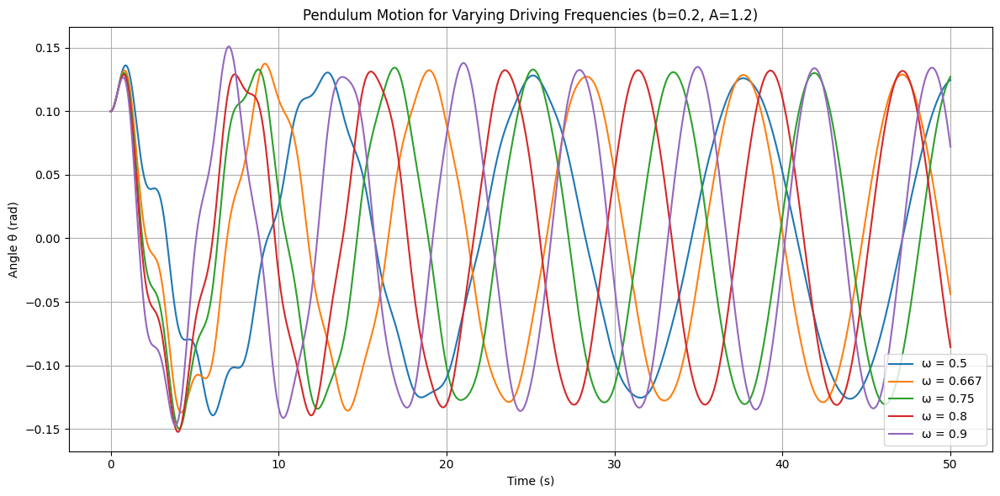
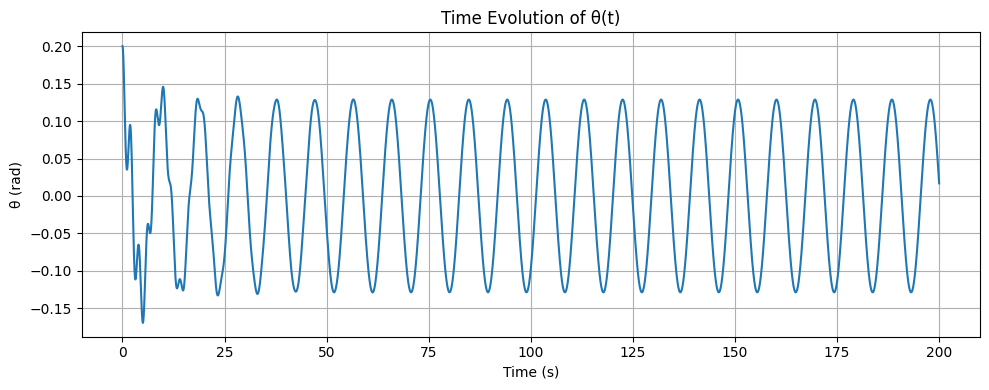
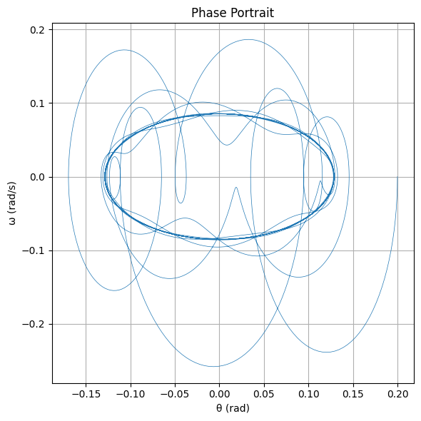
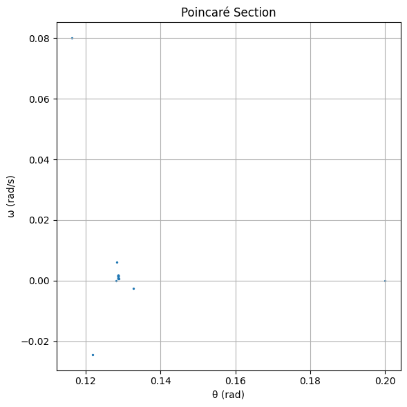

# Problem 2
#  Task 1: Governing Equation and Small-Angle Approximation

###  Objective:
To derive the approximate solutions of the **forced damped pendulum** under the small-angle approximation and explore the **resonance conditions** and their implications on the system’s energy.

---

##  Governing Differential Equation

The motion of a **forced damped pendulum** is described by the following second-order nonlinear differential equation:

$$
\frac{d^2\theta}{dt^2} + b\frac{d\theta}{dt} + \frac{g}{L} \sin(\theta) = A \cos(\omega t)
$$

Where:

- $\theta(t)$: angular displacement (in radians)
- $b$: damping coefficient (viscous damping)
- $g$: acceleration due to gravity
- $L$: length of the pendulum
- $A$: amplitude of external driving force
- $\omega$: angular frequency of external driving force

---

##  Small-Angle Approximation

For **small angles** ($|\theta| \ll 1$), we can linearize the equation using:

$$
\sin(\theta) \approx \theta
$$

This transforms the original nonlinear equation into a **linear second-order nonhomogeneous ODE**:

$$
\frac{d^2\theta}{dt^2} + b\frac{d\theta}{dt} + \frac{g}{L} \theta = A \cos(\omega t)
$$

Let:
- $\omega_0^2 = \frac{g}{L}$ be the **natural angular frequency** of the pendulum.

Then the equation becomes:

$$
\frac{d^2\theta}{dt^2} + b\frac{d\theta}{dt} + \omega_0^2 \theta = A \cos(\omega t)
$$

---

##  General Solution Structure

This equation has a solution of the form:

$$
\theta(t) = \theta_{\text{hom}}(t) + \theta_{\text{part}}(t)
$$

###  Homogeneous Solution (Transient):

Solution to the undriven, damped system:

$$
\frac{d^2\theta}{dt^2} + b\frac{d\theta}{dt} + \omega_0^2 \theta = 0
$$

This has solutions depending on the damping regime:
- Underdamped ($b^2 < 4\omega_0^2$): Oscillatory decay
- Critically damped ($b^2 = 4\omega_0^2$): Fastest return without oscillation
- Overdamped ($b^2 > 4\omega_0^2$): Slow return to equilibrium

### Particular Solution (Steady-State):

We assume a particular solution of the form:

$$
\theta_{\text{part}}(t) = C \cos(\omega t - \delta)
$$

Where:
- $C$: amplitude of the steady-state oscillation
- $\delta$: phase lag

Substituting into the differential equation, we find:

$$
C = \frac{A}{\sqrt{(\omega_0^2 - \omega^2)^2 + b^2 \omega^2}}
$$

$$
\tan(\delta) = \frac{b \omega}{\omega_0^2 - \omega^2}
$$

---

##  Resonance and Energy Implications

###  Resonance Condition:

Resonance occurs when the **denominator of $C$ is minimized**, i.e., when:

$$
\omega \approx \omega_{\text{res}} = \sqrt{\omega_0^2 - \frac{b^2}{2}}
$$

This is the **resonant frequency** of the forced damped oscillator — slightly lower than the natural frequency due to damping.

###  Amplitude at Resonance:

At resonance, amplitude is maximized:

$$
C_{\text{max}} = \frac{A}{b \omega_{\text{res}}}
$$

Small damping $b$ leads to very **large amplitudes** — a hallmark of resonance.

###  Energy Considerations:

The total energy of the pendulum is the sum of kinetic and potential energies. In the presence of damping and driving force:
- The **external force pumps energy into the system**.
- **Damping dissipates energy** as heat.
- At steady state, the energy **input from the driver balances dissipation**, leading to a sustained oscillation.

Resonance implies **maximum energy transfer** from the driver to the pendulum.

---

#  Task 2: Analysis of Dynamics

###  Objective:
To investigate how the **damping coefficient ($b$)**, **driving amplitude ($A$)**, and **driving frequency ($\omega$)** influence the motion of a **forced damped pendulum**, and to examine the transition from **regular** to **chaotic** motion.

---

##  System Equation

We work with the full nonlinear second-order ODE:

$$
\frac{d^2\theta}{dt^2} + b\frac{d\theta}{dt} + \frac{g}{L} \sin(\theta) = A \cos(\omega t)
$$

Let:
- $g = 9.8$
- $L = 1.0$
- The state vector:  
  $$
  \begin{cases}
  \theta_1 = \theta \\
  \theta_2 = \frac{d\theta}{dt}
  \end{cases}
  $$

Then we convert it into a system of first-order ODEs:

$$
\frac{d\theta_1}{dt} = \theta_2 \\
\frac{d\theta_2}{dt} = -b \theta_2 - \frac{g}{L} \sin(\theta_1) + A \cos(\omega t)
$$

---

##  Python Simulation (Runge-Kutta)

```python
import numpy as np
import matplotlib.pyplot as plt
from scipy.integrate import solve_ivp

# Pendulum parameters
g = 9.8
L = 1.0

def forced_damped_pendulum(t, y, b, A, omega):
    theta, omega_theta = y
    dtheta_dt = omega_theta
    domega_dt = -b * omega_theta - (g / L) * np.sin(theta) + A * np.cos(omega * t)
    return [dtheta_dt, domega_dt]

def simulate_pendulum(b, A, omega, t_max=50, y0=[0.1, 0.0]):
    t_span = (0, t_max)
    t_eval = np.linspace(*t_span, 5000)
    sol = solve_ivp(forced_damped_pendulum, t_span, y0, t_eval=t_eval, args=(b, A, omega))
    
    return sol.t, sol.y[0]

def plot_pendulum(t, theta, label):
    plt.plot(t, theta, label=label)

# Parameter sets to analyze
params = [
    (0.2, 1.2, 0.5),
    (0.2, 1.2, 0.667),
    (0.2, 1.2, 0.75),
    (0.2, 1.2, 0.8),
    (0.2, 1.2, 0.9),
]

plt.figure(figsize=(12, 6))
for b, A, omega in params:
    t, theta = simulate_pendulum(b, A, omega)
    plot_pendulum(t, theta, f"ω = {omega}")

plt.title("Pendulum Motion for Varying Driving Frequencies (b=0.2, A=1.2)")
plt.xlabel("Time (s)")
plt.ylabel("Angle θ (rad)")
plt.legend()
plt.grid(True)
plt.tight_layout()
plt.show()
```



#  Task 3: Practical Applications of the Forced Damped Pendulum

###  Objective:
To explore and discuss **real-world systems** where the **forced damped pendulum** serves as a physical or conceptual model. This includes mechanical, electrical, and biological systems where external forces, restoring forces, and damping interact dynamically.

---

##  General Characteristics of the System

The forced damped pendulum features:

- A **restoring force** (gravity or equivalent),
- **Damping** (energy loss, often proportional to velocity),
- A **periodic driving force** (external influence),
- **Nonlinearity** (from the $\sin(\theta)$ term),
- Potential for **chaotic behavior**.

These features appear in many engineering and natural systems.

---

##  1. Energy Harvesting Devices

**Example:** Vibration-based energy harvesters in mechanical or wearable systems.

- **Concept**: Use ambient vibrations to induce oscillations in a mechanical structure.
- The structure is often modeled as a **damped, driven oscillator**.
- Engineers tune the **driving frequency** to match the system’s **resonant frequency** to **maximize power output**.
- **Nonlinearities** (like pendulum mechanics) can improve efficiency by widening the operational frequency range.

**Analogous Behavior**:
- Maximum energy transfer at resonance.
- Damping controls how quickly steady-state is reached and affects energy dissipation.

---

##  2. Suspension Bridges and Mechanical Structures

**Example:** Tacoma Narrows Bridge collapse (1940).

- Bridges and tall buildings can be modeled as **oscillatory systems** exposed to **periodic wind forces**.
- If the driving force (wind gusts) matches the structure’s natural frequency, **resonance** can cause **catastrophic oscillations**.
- **Damping mechanisms** (e.g., tuned mass dampers) are installed to absorb excess energy and **suppress chaotic motion**.

**Link to Pendulum Model**:
- The deck or tower acts like a driven pendulum.
- Resonance conditions cause large amplitude oscillations.
- Structural failure occurs when amplitude exceeds design tolerance.

---

##  3. Electrical Analog: Driven RLC Circuits

The **RLC circuit** is the **electrical analog** of the mechanical forced damped pendulum.

- **Inductor (L)** ↔ Mass or inertia
- **Resistor (R)** ↔ Damping
- **Capacitor (C)** ↔ Restoring force (spring)
- **Voltage Source** ↔ Driving force

**Equation for RLC circuit**:

$$
L \frac{d^2q}{dt^2} + R \frac{dq}{dt} + \frac{q}{C} = V_0 \cos(\omega t)
$$

This is mathematically equivalent to:

$$
\frac{d^2\theta}{dt^2} + b\frac{d\theta}{dt} + \omega_0^2 \theta = A \cos(\omega t)
$$

**Applications**:
- Resonant tuning in radios and filters.
- Studying transient response in power systems.
- Understanding oscillations in neural or biological circuits.

---

## 4. Human Gait and Biomechanics

**Example**: Swinging limbs during walking or running.

- The leg can be modeled as a **damped pendulum** with external forcing from muscle contractions and ground reaction forces.
- The driving frequency (stride rate) and energy dissipation (muscle fatigue, damping) influence motion efficiency.

**Insights**:
- Optimizing gait involves resonance-like effects: matching body mechanics with stride timing.
- Damping models help explain recovery from perturbations (e.g., tripping).

---

##  5. Climate and Ecological Systems

**Example**: El Niño–Southern Oscillation (ENSO), predator-prey cycles.

- Some models in climate and population dynamics resemble **driven nonlinear oscillators**.
- **External forcing** (e.g., solar cycles) + **internal feedback loops** = complex behavior (resonance, quasi-periodicity, chaos).
- These systems may exhibit **Poincaré recurrence**, **sensitive dependence**, or even **bifurcation cascades** — all seen in forced damped pendulums.

---

##  Summary of Applications

| System                       | Pendulum Analogy                           | Key Dynamics                   |
|-----------------------------|---------------------------------------------|--------------------------------|
| Energy Harvesters           | Driven mass-spring                          | Resonance for max output       |
| Suspension Bridges          | Deck as oscillator under wind               | Catastrophic resonance         |
| RLC Circuits                | Inductor–Capacitor–Resistor system          | Oscillations, damping, tuning  |
| Human Gait                  | Leg swing under muscle forcing              | Periodic forcing, stability    |
| Climate Systems             | Feedback + external driving                 | Chaos, bifurcations            |


#  Task 4: Implementation and Visualization

###  Objective:
To simulate the **forced damped pendulum** using numerical methods and visualize:

- Time evolution
- Phase portraits
- Poincaré sections

...to study how **damping**, **driving force**, and **initial conditions** affect transitions to **chaos**.

---

##  Differential Equation

The nonlinear forced damped pendulum is governed by:

$$
\frac{d^2\theta}{dt^2} + b\frac{d\theta}{dt} + \frac{g}{L} \sin(\theta) = A \cos(\omega t)
$$

Converted to first-order ODEs:

$$
\frac{d\theta}{dt} = \omega_\theta \\
\frac{d\omega_\theta}{dt} = -b \omega_\theta - \frac{g}{L} \sin(\theta) + A \cos(\omega t)
$$

---

##  Python Code: Simulation & Visualization

```python
import numpy as np
import matplotlib.pyplot as plt
from scipy.integrate import solve_ivp

# Parameters
g = 9.8
L = 1.0

def pendulum(t, y, b, A, omega_drive):
    theta, omega_theta = y
    dtheta_dt = omega_theta
    domega_dt = -b * omega_theta - (g / L) * np.sin(theta) + A * np.cos(omega_drive * t)
    return [dtheta_dt, domega_dt]

# Simulation function
def simulate(b, A, omega_drive, y0, t_max=200, t_points=10000):
    t_eval = np.linspace(0, t_max, t_points)
    sol = solve_ivp(pendulum, (0, t_max), y0, t_eval=t_eval, args=(b, A, omega_drive), rtol=1e-9, atol=1e-9)
    return sol.t, sol.y[0], sol.y[1]

# Poincaré section sampling
def poincare_section(t, theta, omega_theta, omega_drive):
    T_drive = 2 * np.pi / omega_drive
    poincare_times = np.arange(0, t[-1], T_drive)
    indices = [np.abs(t - pt).argmin() for pt in poincare_times]
    return theta[indices], omega_theta[indices]

# Parameters (chaotic regime)
b = 0.2
A = 1.2
omega_drive = 0.667
y0 = [0.2, 0.0]  # initial conditions

# Run simulation
t, theta, omega_theta = simulate(b, A, omega_drive, y0)

# Wrap theta to [-pi, pi] for clarity
theta_wrapped = (theta + np.pi) % (2 * np.pi) - np.pi

# Plot time evolution
plt.figure(figsize=(10, 4))
plt.plot(t, theta_wrapped)
plt.title("Time Evolution of θ(t)")
plt.xlabel("Time (s)")
plt.ylabel("θ (rad)")
plt.grid(True)
plt.tight_layout()
plt.show()
```


# Phase space plot
plt.figure(figsize=(6, 6))
plt.plot(theta_wrapped, omega_theta, linewidth=0.5)
plt.title("Phase Portrait")
plt.xlabel("θ (rad)")
plt.ylabel("ω (rad/s)")
plt.grid(True)
plt.tight_layout()
plt.show()
```



# Poincaré section
theta_p, omega_p = poincare_section(t, theta_wrapped, omega_theta, omega_drive)
plt.figure(figsize=(6, 6))
plt.scatter(theta_p, omega_p, s=2)
plt.title("Poincaré Section")
plt.xlabel("θ (rad)")
plt.ylabel("ω (rad/s)")
plt.grid(True)
plt.tight_layout()
plt.show()
```
