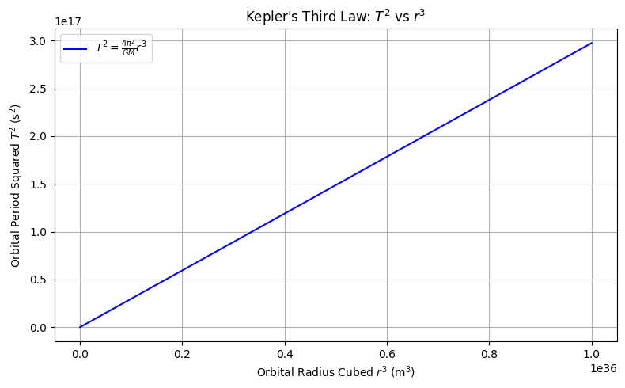

Here's a complete, clear, and well-formatted **Markdown document** that derives **Kepler's Third Law** for circular orbits, including **formulas**, **Python code**, and explanations.

---

#  Orbital Period and Orbital Radius (Kepler's Third Law)

## Objective

Derive the relationship between the **square of the orbital period** and the **cube of the orbital radius** for circular orbits, based on Newtonian mechanics.

---

##  Derivation of Kepler's Third Law for Circular Orbits

### Newton’s Law of Universal Gravitation

The gravitational force between two masses $M$ (e.g., the Sun) and $m$ (e.g., a planet) is:

$$
F_{\text{gravity}} = \frac{G M m}{r^2}
$$

Where:

* $G$ is the gravitational constant ($6.674 \times 10^{-11} \, \text{Nm}^2/\text{kg}^2$)
* $r$ is the distance (orbital radius) between the two bodies

### Centripetal Force for Circular Motion

A mass $m$ in circular motion with orbital speed $v$ experiences a centripetal force:

$$
F_{\text{centripetal}} = \frac{m v^2}{r}
$$

### Set Gravitational Force = Centripetal Force

$$
\frac{G M m}{r^2} = \frac{m v^2}{r}
$$

Cancel $m$ on both sides:

$$
\frac{G M}{r^2} = \frac{v^2}{r}
\Rightarrow v^2 = \frac{G M}{r}
$$

### Express Orbital Speed $v$ in Terms of Orbital Period $T$

For a circular orbit:

$$
v = \frac{2\pi r}{T}
$$

Substitute into previous equation:

$$
\left( \frac{2\pi r}{T} \right)^2 = \frac{G M}{r}
\Rightarrow \frac{4\pi^2 r^2}{T^2} = \frac{G M}{r}
$$

Multiply both sides by $r$:

$$
\frac{4\pi^2 r^3}{T^2} = G M
$$

Finally, solve for $T^2$:

$$
T^2 = \frac{4\pi^2}{G M} r^3
$$

---

## ✅ Final Result

$$
\boxed{T^2 \propto r^3}
$$

