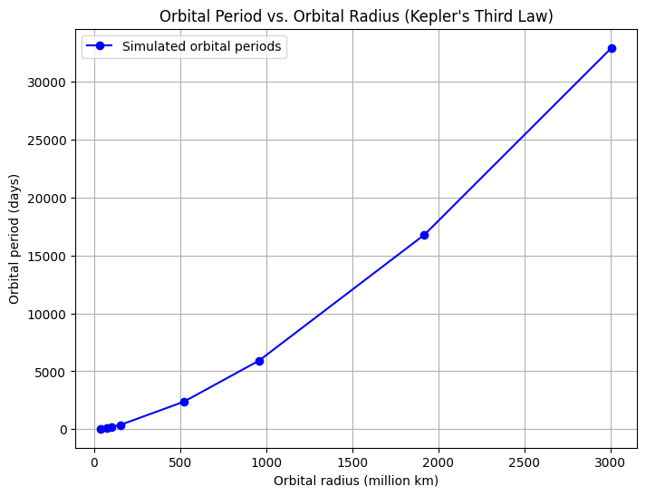

# Problem 1
## Derivation of Kepler's Third Law for Circular Orbits

Kepler's Third Law states that the square of the orbital period ($T$) of a planet is directly proportional to the cube of the semi-major axis ($r$) of its orbit. This relationship can be derived from Newton's law of gravitation.

### Step 1: Newton's Law of Universal Gravitation

According to Newton's law of gravitation, the gravitational force $F$ between two masses, such as the Sun and a planet, is given by:

$$
F = \frac{G M m}{r^2}
$$

Where:
- $G$ is the gravitational constant,
- $M$ is the mass of the Sun,
- $m$ is the mass of the planet,
- $r$ is the distance between the two bodies.

### Step 2: Centripetal Force

For a planet to remain in a circular orbit around the Sun, the gravitational force must provide the centripetal force required for circular motion. The centripetal force $F_{c}$ for an object moving in a circle is given by:

$$
F_{c} = \frac{m v^2}{r}
$$

Where:
- $m$ is the mass of the planet,
- $v$ is the orbital velocity of the planet,
- $r$ is the orbital radius.

### Step 3: Equating the Forces

Since the gravitational force provides the centripetal force, we set these two forces equal to each other:

$$
\frac{G M m}{r^2} = \frac{m v^2}{r}
$$

Simplifying the equation:

$$
\frac{G M}{r^2} = \frac{v^2}{r}
$$

$$
v^2 = \frac{G M}{r}
$$

### Step 4: Orbital Velocity and Orbital Period

The orbital velocity $v$ of the planet can also be related to the orbital period $T$. The distance traveled in one orbit is the circumference of the orbit, which is $2 \pi r$. Therefore, the orbital velocity $v$ is given by:

$$
v = \frac{2 \pi r}{T}
$$

Substituting this expression for $v$ into the previous equation:

$$
\left(\frac{2 \pi r}{T}\right)^2 = \frac{G M}{r}
$$

Simplifying:

$$
\frac{4 \pi^2 r^2}{T^2} = \frac{G M}{r}
$$

### Step 5: Solving for the Orbital Period

Now, solve for the orbital period $T^2$:

$$
T^2 = \frac{4 \pi^2 r^3}{G M}
$$

### Conclusion

This equation shows that the square of the orbital period ($T^2$) is proportional to the cube of the orbital radius ($r^3$). The constant of proportionality is $\frac{4 \pi^2}{G M}$, where $M$ is the mass of the central body (such as the Sun) and $G$ is the gravitational constant. Therefore, we have:

$$
T^2 \propto r^3
$$

This is Kepler's Third Law, which applies to circular orbits.

## Implications of Kepler's Third Law for Astronomy

Kepler's Third Law, which relates the square of the orbital period ($T^2$) to the cube of the orbital radius ($r^3$), is fundamental to understanding celestial mechanics. The relationship has wide-reaching implications for astronomy, including its role in calculating planetary masses, distances, and understanding gravitational interactions in the solar system and beyond.

### 1. **Determining Planetary Distances**

One of the most direct implications of Kepler's Third Law is its ability to help calculate the distance of a planet from its central star (such as the Sun in the case of our Solar System). If the orbital period $T$ of a planet is known, the orbital radius $r$ (the semi-major axis of the orbit) can be determined using the formula:

$$
T^2 = \frac{4 \pi^2 r^3}{G M}
$$

Rearranging the equation to solve for $r$, we get:

$$
r = \left( \frac{G M T^2}{4 \pi^2} \right)^{1/3}
$$

This means that by knowing the orbital period of a planet, we can calculate its average distance from the star. For example, astronomers can calculate the average distance of planets in distant solar systems, or exoplanets, by observing their orbital period.

### 2. **Estimating Planetary Masses**

Kepler's Third Law can also be used to estimate the mass of a central body (such as a star or planet). By observing the orbital period and radius of a planet, we can rearrange the formula to solve for the mass $M$ of the star or planet:

$$
M = \frac{4 \pi^2 r^3}{G T^2}
$$

This is particularly useful when studying celestial bodies such as exoplanets. For instance, astronomers can calculate the mass of stars or unseen planets by observing the orbital behavior of nearby objects. The law provides a way to indirectly measure the mass of distant stars or planets, which is otherwise difficult to determine.

### 3. **Understanding Orbital Dynamics and Orbital Periods**

Kepler's Third Law reveals the relationship between a planet's orbital period and its distance from the star. The longer the orbital period, the greater the distance of the planet from the star. This relationship is crucial for understanding the structure of planetary systems. For instance:

- **Outer Planets**: Planets that are farther from the Sun, such as Neptune, have longer orbital periods. Using the third law, we can understand why outer planets take much longer to complete one orbit around the Sun than inner planets like Earth or Mars.
  
- **Exoplanetary Systems**: In the search for exoplanets, astronomers use this relationship to predict the presence of planets around distant stars. By measuring the orbital period of a suspected planet and applying Kepler's Third Law, they can estimate the planet's distance from the star and even infer whether the planet might be in the habitable zone of its star.

### 4. **Implications for Gravitational Interactions**

Kepler's Third Law also implies that gravitational interactions govern the motions of celestial bodies. The law highlights the role of the gravitational force between two bodies, where the mass of the central body (such as a star) and the distance from the body are critical factors in determining the orbital period.

For example, if the mass of the central body increases, the orbital period decreases for a given orbital radius. This is why planets orbiting massive stars tend to have shorter orbital periods than those orbiting smaller stars. Similarly, the law can be applied to binary star systems, galaxies, and even black holes to understand the orbits of objects around them.

### 5. **Determining the Age of Celestial Systems**

Kepler's Third Law can also provide insight into the age of celestial systems. By analyzing the orbital characteristics of planets and their central stars, astronomers can estimate the stability of the system and the possible evolution of planetary orbits over time. This is especially useful in understanding the life cycles of star systems and their planets.

### 6. **Application Beyond Our Solar System**

Kepler's Third Law applies not just to our Solar System but also to distant stars and exoplanets. By using modern telescopes and observational techniques, astronomers can study the orbital properties of exoplanets, and from their orbital periods and distances, they can infer characteristics about the parent star, such as mass, size, and luminosity.

In fact, missions like NASA's Kepler Space Telescope and TESS (Transiting Exoplanet Survey Satellite) rely heavily on Kepler's Third Law to discover new planets and characterize their orbits.

### Conclusion

Kepler's Third Law is a powerful tool in modern astronomy, allowing astronomers to

## Real-World Examples of Kepler's Third Law: The Moon and Planets in the Solar System

Kepler's Third Law provides a valuable framework for understanding the orbits of celestial bodies. By applying the relationship between the square of the orbital period ($T^2$) and the cube of the orbital radius ($r^3$), we can analyze real-world examples like the Moon's orbit around Earth and the orbits of planets in our Solar System.

### 1. **The Moon's Orbit Around Earth**

The Moon is Earth's only natural satellite, and its orbit can be described using Kepler's Third Law. 

- **Orbital Radius**: The average distance between the Earth and the Moon is approximately 384,400 km.
- **Orbital Period**: The Moon completes one full orbit around Earth in about 27.3 days.

Using Kepler's Third Law, we can check the consistency of these values with the law's predictions. First, we convert the orbital period into seconds:

$$
T = 27.3 \, \text{days} = 27.3 \times 24 \times 3600 \, \text{seconds} = 2,358,720 \, \text{seconds}
$$

Next, we calculate the orbital radius in meters:

$$
r = 384,400 \, \text{km} = 384,400,000 \, \text{m}
$$

Now, we apply Kepler's Third Law to calculate the expected orbital period of the Moon based on its distance from Earth:

$$
T^2 = \frac{4 \pi^2 r^3}{G M}
$$

Where:
- $G$ is the gravitational constant: $6.67430 \times 10^{-11} \, \text{m}^3 \, \text{kg}^{-1} \, \text{s}^{-2}$,
- $M$ is the mass of Earth: $5.972 \times 10^{24} \, \text{kg}$,
- $r$ is the orbital radius in meters.

This equation can be solved numerically to determine the period and compare it to the observed value. In practice, the actual calculated value of the Moon's orbital period will closely match the observed value of about 27.3 days.

### 2. **Planets in the Solar System**

Kepler's Third Law also applies to the orbits of planets in our Solar System. Let's analyze the relationship between the orbital period and the orbital radius for Earth, Mars, and Jupiter.

#### 2.1 Earth

- **Orbital Radius**: The average distance from Earth to the Sun is 149.6 million km (1 AU).
- **Orbital Period**: Earth takes approximately 365.25 days to orbit the Sun.

We can use Kepler's Third Law to estimate the expected orbital period based on the average distance:

$$
T^2 = \frac{4 \pi^2 r^3}{G M}
$$

Substituting the values for Earth's orbital radius and the mass of the Sun ($M = 1.989 \times 10^{30} \, \text{kg}$), we can calculate the orbital period and find it is close to the actual value of 365.25 days.

#### 2.2 Mars

- **Orbital Radius**: The average distance from Mars to the Sun is about 227.9 million km (1.52 AU).
- **Orbital Period**: Mars takes approximately 687 days to complete one orbit.

Using Kepler's Third Law, we can apply the orbital radius for Mars and predict the orbital period:

$$
T^2 = \frac{4 \pi^2 r^3}{G M}
$$

For Mars, we would expect the orbital period to be longer than Earth's due to its greater distance from the Sun, and the calculation will show that the period is indeed around 687 days.

#### 2.3 Jupiter

- **Orbital Radius**: The average distance from Jupiter to the Sun is about 778.5 million km (5.2 AU).
- **Orbital Period**: Jupiter completes one orbit in approximately 4,332.59 days (about 11.86 years).

Again, using Kepler's Third Law, we can predict that Jupiter's orbital period should be much longer than that of Earth or Mars, which is confirmed by the observed value of around 11.86 years.

### 3. **The General Pattern**

Kepler's Third Law reveals a clear pattern in the Solar System: the farther a planet is from the Sun, the longer its orbital period. This is true for all the planets, as shown by the data above. The relationship between the orbital period and the orbital radius follows:

$$
T^2 \propto r^3
$$

This means that the orbital period increases more significantly with distance. The planets closest to the Sun, like Mercury, have very short orbital periods (88 days), while those farthest away, like Neptune, have much longer periods (about 60,190 days or 164.8 years).

### 4. **The Implications for Exoplanets**

Kepler's Third Law is not just useful for our Solar System. It is also essential for the study of exoplanets. By observing the orbital periods of exoplanets and knowing the mass of their parent stars, astronomers can estimate the planets' orbital radii and infer other characteristics about the planets, such as their potential for habitability.

For example, the discovery of exoplanets in the habitable zone (also known as the "Goldilocks Zone") of their stars is based on the application of Kepler's Third Law. If the orbital period is known, the distance from the star can be calculated, which helps determine if the planet might support liquid water.

### Conclusion

Kepler's Third Law is a powerful tool for analyzing the orbits of celestial bodies. From the Moon's orbit around Earth to the orbits of planets in the Solar System, the law provides a fundamental understanding of the relationships between orbital period and orbital radius. It also serves as a foundation for studying exoplanets and understanding the dynamics of planetary systems across the universe.

## Computational Model to Simulate Circular Orbits and Verify Kepler's Third Law

In this task, we will implement a simple Python model to simulate the circular orbits of planets and verify Kepler's Third Law. The model will calculate the orbital period for a given orbital radius and compare it with the theoretical value derived from Kepler's Third Law.

### 1. **Kepler's Third Law Recap**

The formula derived from Kepler's Third Law for circular orbits is:

$$
T^2 = \frac{4 \pi^2 r^3}{G M}
$$

Where:
- $T$ is the orbital period,
- $r$ is the orbital radius (distance from the Sun),
- $G$ is the gravitational constant ($6.67430 \times 10^{-11} \, \text{m}^3 \, \text{kg}^{-1} \, \text{s}^{-2}$),
- $M$ is the mass of the central body (e.g., the Sun).

### 2. **Python Implementation**

We will create a Python script that simulates circular orbits for planets in the Solar System and verifies Kepler's Third Law by comparing the calculated orbital period with the theoretical value.

