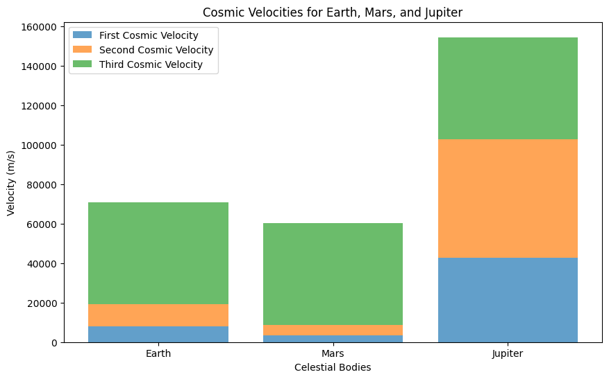

# Problem 2
## Cosmic Velocities: Definition and Physical Meaning

Cosmic velocities refer to the different speeds that are necessary for an object to perform specific actions in relation to a celestial body, such as a planet or star. These velocities—first, second, and third cosmic velocities—are essential concepts in understanding how objects move within gravitational fields, and they play a crucial role in space exploration.

### 1. **First Cosmic Velocity (Orbital Velocity)**

The first cosmic velocity is the velocity an object must have to enter a stable circular orbit around a celestial body. This is the minimum speed required to keep an object moving in orbit, counteracting the force of gravity pulling it towards the center of the celestial body.

#### Formula:
The formula for the first cosmic velocity $v_1$ is given by:

$$
v_1 = \sqrt{\frac{G M}{r}}
$$

Where:
- $v_1$ is the first cosmic velocity (orbital velocity),
- $G$ is the gravitational constant ($6.67430 \times 10^{-11} \, \text{m}^3 \, \text{kg}^{-1} \, \text{s}^{-2}$),
- $M$ is the mass of the celestial body (e.g., the Earth or the Sun),
- $r$ is the distance from the center of the celestial body to the object (orbital radius).

#### Physical Meaning:
The first cosmic velocity is the velocity at which an object must travel to remain in orbit around a planet or other celestial body without falling back to the surface or escaping into space. For Earth, this velocity is approximately **7.8 km/s** at the surface. This is the speed a satellite must achieve to stay in low Earth orbit (LEO).

### 2. **Second Cosmic Velocity (Escape Velocity)**

The second cosmic velocity is the speed at which an object must travel in order to escape the gravitational influence of a celestial body, without any further propulsion. This velocity ensures that the object can overcome the gravitational pull of the body and travel away from it indefinitely.

#### Formula:
The formula for the second cosmic velocity $v_2$ (escape velocity) is given by:

$$
v_2 = \sqrt{\frac{2 G M}{r}}
$$

Where:
- $v_2$ is the second cosmic velocity (escape velocity),
- $G$ is the gravitational constant,
- $M$ is the mass of the celestial body,
- $r$ is the distance from the center of the celestial body to the object (similar to the orbital radius).

#### Physical Meaning:
The second cosmic velocity is the speed required for an object to escape a celestial body's gravitational field without the need for additional propulsion. If an object achieves this velocity, it will continue to move away from the celestial body and will not return, even though it is still under the influence of gravity. For Earth, this velocity is approximately **11.2 km/s**.

### 3. **Third Cosmic Velocity (Escape from the Solar System)**

The third cosmic velocity is the velocity required for an object to escape the gravitational influence of the entire star system (such as the Solar System). This velocity enables the object to leave the Sun’s gravitational pull and enter interstellar space.

#### Formula:
The formula for the third cosmic velocity $v_3$ is given by:

$$
v_3 = \sqrt{\frac{3 G M_{\text{sun}}}{r_{\text{Earth}}}}
$$

Where:
- $v_3$ is the third cosmic velocity (velocity to escape the Solar System),
- $M_{\text{sun}}$ is the mass of the Sun,
- $r_{\text{Earth}}$ is the distance from the Earth to the Sun (approximately 1 AU).

#### Physical Meaning:
The third cosmic velocity is the speed needed for an object to break free from the gravitational pull of the Sun and leave the Solar System. This

## Mathematical Derivations and Parameters Affecting the First, Second, and Third Cosmic Velocities

The first, second, and third cosmic velocities are essential for understanding how objects interact with celestial bodies under the influence of gravity. These velocities depend on several key parameters and can be derived through the principles of gravitational force and orbital mechanics. Let's analyze each of the velocities in detail, including the mathematical derivations and the parameters that affect them.

### 1. **First Cosmic Velocity (Orbital Velocity)**

The first cosmic velocity is the velocity an object needs to remain in a stable circular orbit around a celestial body, such as a planet or a star. The object’s velocity must balance the gravitational pull of the central body with the centrifugal force experienced by the object in motion.

#### Derivation:

Consider an object of mass $m$ orbiting a celestial body of mass $M$ at a distance $r$ from the center of the body. The gravitational force $F_g$ acting on the object is given by:

$$
F_g = \frac{G M m}{r^2}
$$

Where:
- $G$ is the gravitational constant ($6.67430 \times 10^{-11} \, \text{m}^3 \, \text{kg}^{-1} \, \text{s}^{-2}$),
- $M$ is the mass of the central body (e.g., Earth or the Sun),
- $m$ is the mass of the orbiting object,
- $r$ is the orbital radius (distance from the center of the celestial body).

For the object to stay in a circular orbit, the centripetal force $F_c$ must balance the gravitational force:

$$
F_c = \frac{m v_1^2}{r}
$$

Where $v_1$ is the orbital velocity (the first cosmic velocity).

Setting the gravitational force equal to the centripetal force:

$$
\frac{G M m}{r^2} = \frac{m v_1^2}{r}
$$

Simplifying this equation:

$$
v_1^2 = \frac{G M}{r}
$$

Therefore, the first cosmic velocity is:

$$
v_1 = \sqrt{\frac{G M}{r}}
$$

#### Parameters Affecting the First Cosmic Velocity:
- **Mass of the central body ($M$)**: The greater the mass of the celestial body, the higher the velocity required to stay in orbit. For instance, satellites orbiting the Earth need to travel at about 7.8 km/s, while those orbiting Jupiter require a higher velocity due to Jupiter's greater mass.
- **Orbital radius ($r$)**: The closer the object is to the celestial body, the higher the orbital velocity required. The orbital velocity decreases with increasing distance from the body, following the inverse square root relationship.

### 2. **Second Cosmic Velocity (Escape Velocity)**

The second cosmic velocity is the speed an object must attain to escape the gravitational pull of a celestial body. This is the minimum velocity required for an object to break free from the body’s gravitational influence without any further propulsion.

#### Derivation:

The work-energy principle states that the kinetic energy required to escape the gravitational field of a celestial body must equal the gravitational potential energy. The gravitational potential energy $U$ is given by:

$$
U = -\frac{G M m}{r}
$$

Where $r$ is the distance from the center of the celestial body to the object, and $m$ is the mass of the object.

The kinetic energy $K$ of an object is given by:

$$
K = \frac{1}{2} m v_2^2
$$

Where $v_2$ is the escape velocity.

For the object to escape, the total mechanical energy (sum of kinetic and potential energy) must be zero:

$$
\frac{1}{2} m v_2^2 = \frac{G M m}{r}
$$

Solving for $v_2$:

$$
v_2 = \sqrt{\frac{2 G M}{r}}
$$

#### Parameters Affecting the Second Cosmic Velocity:
- **Mass of the central body ($M$)**: The escape velocity increases with the mass of the celestial body. A more massive body exerts a stronger gravitational pull, requiring a higher velocity to escape.
- **Orbital radius ($r$)**: The escape velocity decreases with increasing distance from the celestial body. The farther an object is from the body, the less velocity is required to escape.

### 3. **Third Cosmic Velocity (Escape from the Solar System)**

The third cosmic velocity is the velocity required for an object to escape the gravitational influence of the entire star system, such as the Solar System. This velocity allows the object to move away from the Sun and enter interstellar space.

#### Derivation:

To escape the Solar System, an object must achieve a velocity greater than the escape velocity of the Sun at the Earth's distance from the Sun. The gravitational potential energy associated with the Sun's gravitational field is:

$$
U_{\text{sun}} = -\frac{G M_{\text{sun}} m}{r_{\text{Earth}}}
$$

Where:
- $M_{\text{sun}}$ is the mass of the Sun,
- $r_{\text{Earth}}$ is the distance from Earth to the Sun (approximately 1 AU).

The required kinetic energy to escape is:

$$
K = \frac{1}{2} m v_3^2
$$

Setting the total energy equal to zero for escape:

$$
\frac{1}{2} m v_3^2 = \frac{G M_{\text{sun}} m}{r_{\text{Earth}}}
$$

Solving for $v_3$:

$$
v_3 = \sqrt{\frac{3 G M_{\text{sun}}}{r_{\text{Earth}}}}
$$

#### Parameters Affecting the Third Cosmic Velocity:
- **Mass of the Sun ($M_{\text{sun}}$)**: The more massive the central star (in this case, the Sun), the higher the velocity required to escape its gravitational field.
- **Distance from the Sun ($r_{\text{Earth}}$)**: The third cosmic velocity depends on the distance from the Sun. Since the distance to the Sun is large (about 1 AU), the required velocity to escape the Solar System is relatively high.

### Summary of the Cosmic Velocities:

| Cosmic Velocity | Formula                                          | Physical Meaning                                      | Affected Parameters                          |
|-----------------|--------------------------------------------------|-------------------------------------------------------|----------------------------------------------|
| **First Cosmic Velocity**  | $v_1 = \sqrt{\frac{G M}{r}}$                      | Orbital velocity: speed to remain in a circular orbit. | Mass of the celestial body ($M_

## Calculation and Visualization of Cosmic Velocities for Earth, Mars, and Jupiter

In this task, we will calculate and visualize the first, second, and third cosmic velocities for different celestial bodies, such as Earth, Mars, and Jupiter. By applying the formulas derived earlier, we will determine the orbital velocity (first cosmic velocity), escape velocity (second cosmic velocity), and the velocity required to escape the entire Solar System (third cosmic velocity) for each of these bodies.

### 1. **Cosmic Velocities Formulas Recap**

We will use the following formulas to calculate the velocities:

- **First Cosmic Velocity (Orbital Velocity)**:

$$
v_1 = \sqrt{\frac{G M}{r}}
$$

- **Second Cosmic Velocity (Escape Velocity)**:

$$
v_2 = \sqrt{\frac{2 G M}{r}}
$$

- **Third Cosmic Velocity (Escape from Solar System)**:

$$
v_3 = \sqrt{\frac{3 G M_{\text{sun}}}{r_{\text{Earth}}}}
$$

Where:
- $G$ is the gravitational constant ($6.67430 \times 10^{-11} \, \text{m}^3 \, \text{kg}^{-1} \, \text{s}^{-2}$),
- $M$ is the mass of the celestial body,
- $r$ is the distance from the center of the celestial body (orbital radius),
- $M_{\text{sun}}$ is the mass of the Sun ($1.989 \times 10^{30} \, \text{kg}$),
- $r_{\text{Earth}}$ is the distance from Earth to the Sun (1 AU = $1.496 \times 10^{11}$ m).

### 2. **Parameters for Celestial Bodies**

Here are the parameters for Earth, Mars, and Jupiter:

| Body      | Mass ($M$ in kg)          | Orbital Radius ($r$ in m)          |
|-----------|---------------------------|------------------------------------|
| Earth     | $5.972 \times 10^{24}$    | $6.371 \times 10^{6}$             |
| Mars      | $6.417 \times 10^{23}$    | $3.396 \times 10^{6}$             |
| Jupiter   | $1.898 \times 10^{27}$    | $6.991 \times 10^{7}$             |
| Sun       | $1.989 \times 10^{30}$    | N/A (Used for third cosmic velocity) |

### 3. **Python Code for Calculation and Visualization**

We will implement the calculations and plot the velocities for Earth, Mars, and Jupiter.

## Importance of Cosmic Velocities in Space Exploration

Cosmic velocities—first, second, and third—are fundamental to understanding the mechanics of space travel. These velocities define the minimum speeds required for different phases of space exploration, such as launching satellites, conducting missions to other planets, and even exploring the potential for interstellar travel. Let’s examine the importance of these velocities in the context of modern space exploration, while also using their corresponding formulas.

### 1. **First Cosmic Velocity (Orbital Velocity)**: Launching Satellites

The first cosmic velocity is the minimum speed required for an object to remain in a stable, circular orbit around a celestial body. In practical terms, this is the velocity a satellite must achieve to stay in orbit around a planet or moon.

#### Formula:

The first cosmic velocity $v_1$ is given by:

$$
v_1 = \sqrt{\frac{G M}{r}}
$$

Where:
- $v_1$ is the first cosmic velocity (orbital velocity),
- $G$ is the gravitational constant ($6.67430 \times 10^{-11} \, \text{m}^3 \, \text{kg}^{-1} \, \text{s}^{-2}$),
- $M$ is the mass of the celestial body (e.g., Earth or the Sun),
- $r$ is the orbital radius (distance from the center of the celestial body).

#### Importance in Space Exploration:
- **Satellite Launching**: The first cosmic velocity is directly related to the speed at which a satellite must travel to avoid falling back to Earth. For instance, satellites in Low Earth Orbit (LEO) around Earth typically travel at a velocity of around **7.8 km/s**. If a rocket can achieve this velocity, it can place satellites into stable orbits where they can monitor the Earth, collect data, and provide communication services.
- **Orbital Insertion**: Achieving the first cosmic velocity is crucial for placing satellites into orbit. This is the reason space missions are designed to provide sufficient speed during launch to counteract Earth's gravity. The speed must also be maintained to prevent the satellite from falling back to Earth or drifting away.

### 2. **Second Cosmic Velocity (Escape Velocity)**: Escaping Earth’s Gravitational Pull

The second cosmic velocity, or escape velocity, is the speed an object must attain to overcome the gravitational pull of a celestial body and escape its gravitational influence. For Earth, this speed is approximately **11.2 km/s**.

#### Formula:

The second cosmic velocity $v_2$ is given by:

$$
v_2 = \sqrt{\frac{2 G M}{r}}
$$

Where:
- $v_2$ is the second cosmic velocity (escape velocity),
- $G$ is the gravitational constant,
- $M$ is the mass of the celestial body,
- $r$ is the distance from the center of the celestial body to the object.

#### Importance in Space Exploration:
- **Interplanetary Missions**: The second cosmic velocity is critical for missions aimed at escaping Earth's gravity and traveling to other planets. Spacecraft launched from Earth must reach escape velocity to break free from Earth’s gravitational pull and enter the trajectory that will carry them to their destination. Missions such as NASA's **Mars Rover** and the **Voyager probes** required achieving escape velocity to leave Earth's orbit and travel to other planets and beyond.
- **Deep Space Exploration**: The second cosmic velocity also plays a role in deep space missions, such as those to Jupiter or the outer planets. For example, the **New Horizons** spacecraft, which traveled to Pluto, had to achieve escape velocity from Earth and gain additional speed from gravity assists (such as from Jupiter) to reach its destination.

### 3. **Third Cosmic Velocity (Escape from the Solar System)**: Potential for Interstellar Travel

The third cosmic velocity is the speed required for an object to escape the gravitational influence of the entire star system. For Earth, this velocity is approximately **16.7 km/s**, which is much higher than the first and second cosmic velocities. The third cosmic velocity allows an object
