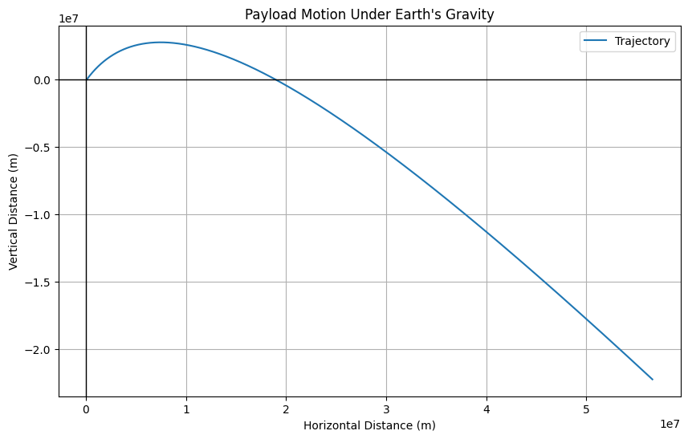

# Problem 3

## Analysis of Possible Trajectories for a Payload Released Near Earth

When a payload is released near Earth, its trajectory depends on several factors, including its initial velocity, the angle of release, and the gravitational influence of Earth. The most common types of trajectories for objects near Earth are **parabolic**, **hyperbolic**, and **elliptical**. These trajectories are determined by the object's velocity relative to Earth and the gravitational force exerted by Earth.

### 1. **Gravitational Force and Energy Considerations**

The gravitational force $F$ acting on an object near Earth is given by Newton’s law of gravitation:

$$
F = \frac{G M m}{r^2}
$$

Where:
- $G$ is the gravitational constant ($6.67430 \times 10^{-11} \, \text{m}^3 \, \text{kg}^{-1} \, \text{s}^{-2}$),
- $M$ is the mass of Earth ($5.972 \times 10^{24} \, \text{kg}$),
- $m$ is the mass of the object,
- $r$ is the distance between the object and the center of Earth.

To describe the trajectory, we need to consider the specific mechanical energy $\epsilon$ of the object, which is the sum of its kinetic energy and potential energy:

$$
\epsilon = \frac{v^2}{2} - \frac{GM}{r}
$$

Where:
- $v$ is the velocity of the object at a given point,
- $r$ is the distance from the center of Earth.

Based on the specific mechanical energy, the trajectory type can be classified into three categories:

### 2. **Elliptical Trajectory**

An elliptical trajectory occurs when the object’s velocity is lower than the escape velocity, but it is still sufficient to form an elliptical orbit around Earth. The object's total energy $\epsilon$ is negative in this case.

#### Condition for Elliptical Trajectory:
For an elliptical orbit, the total energy of the object must be negative:

$$
\epsilon < 0
$$

This means the object is in a bound orbit around Earth. The object will travel in an ellipse, coming closest to Earth at the periapsis (the point of closest approach) and farthest from Earth at the apoapsis.

The orbital parameters of an elliptical orbit are determined by:
- **Semi-major axis** $a$,
- **Eccentricity** $e$.

The relationship between the semi-major axis and the specific orbital energy is given by:

$$
\epsilon = -\frac{GM}{2a}
$$

Where:
- $a$ is the semi-major axis of the ellipse,
- $e$ is the orbital eccentricity, which measures the deviation from a perfect circle.

### 3. **Parabolic Trajectory**

A parabolic trajectory is the special case of an elliptical orbit where the object’s velocity is exactly equal to the escape velocity at a given distance. In this case, the total mechanical energy $\epsilon$ is zero:

$$
\epsilon = 0
$$

#### Condition for Parabolic Trajectory:
For an object to follow a parabolic trajectory, its velocity must be equal to the escape velocity at the point of release:

$$
v = \sqrt{\frac{2GM}{r}}
$$

This velocity is the minimum speed required to escape Earth’s gravitational influence without ever returning, but in a manner that the object’s trajectory forms a parabola. A parabolic trajectory does not form a closed orbit; it is an open curve.

### 4. **Hyperbolic Trajectory**

A hyperbolic trajectory occurs when the object's velocity exceeds the escape velocity at a given distance from Earth. In this case, the total mechanical energy $\epsilon$ is positive:

$$
\epsilon > 0
$$

#### Condition for Hyperbolic Trajectory:
For an object to follow a hyperbolic trajectory, its velocity must be greater than the escape velocity at the point of release:

$$
v > \sqrt{\frac{2GM}{r}}
$$

This means the object has more than enough energy to escape Earth’s gravitational pull and will follow a hyperbolic path. Hyperbolic trajectories are unbound, meaning the object will not return to Earth, and will continue traveling through space.

### 5. **Graphical Representation of Trajectories**

To better visualize the differences in these trajectories, we can plot the paths of the object depending on its initial velocity. Let's simulate and plot these trajectories for a payload released near Earth.

#### Python Code for Trajectory Simulation:

# ##################################################################
## Numerical Analysis of the Path of a Payload Based on Initial Conditions

In this task, we will perform a numerical analysis to compute the path of a payload released near Earth based on given initial conditions, such as position, velocity, and altitude. We will use numerical integration techniques to simulate the trajectory of the object under the influence of Earth's gravity.

### 1. **Equations of Motion**

The motion of the payload can be described using Newton’s law of gravitation and the equations of motion. The acceleration due to gravity at a distance $r$ from the center of Earth is given by:

$$
a(r) = -\frac{G M}{r^2}
$$

Where:
- $a(r)$ is the gravitational acceleration,
- $G$ is the gravitational constant ($6.67430 \times 10^{-11} \, \text{m}^3 \, \text{kg}^{-1} \, \text{s}^{-2}$),
- $M$ is the mass of Earth ($5.972 \times 10^{24} \, \text{kg}$),
- $r$ is the distance from the center of Earth.

Using Newton’s second law, the velocity and position of the payload can be updated using numerical integration.

The velocity update equation is:

$$
v(t+\Delta t) = v(t) + a(t) \cdot \Delta t
$$

And the position update equation is:

$$
r(t+\Delta t) = r(t) + v(t) \cdot \Delta t
$$

Where:
- $v(t)$ is the velocity at time $t$,
- $r(t)$ is the position at time $t$,
- $\Delta t$ is the time step.

### 2. **Initial Conditions**

Let’s define the initial conditions for the simulation:
- Initial position ($r_0$): The initial altitude is given by the distance from the center of Earth. For example, if the payload is launched from a height of 100 km above Earth’s surface, the initial position would be $r_0 = R_{\text{Earth}} + 100\,\text{km}$.
- Initial velocity ($v_0$): This is the initial speed of the payload. For example, if the payload is launched at 8 km/s, this would be the initial velocity.

### 3. **Numerical Integration of the Motion**

We will use the **Euler method** for numerical integration to compute the position and velocity of the payload over time.

#### Python Code for Numerical Analysis:

# ###############################################
## Trajectories and Their Relation to Orbital Insertion, Reentry, and Escape Scenarios

The type of trajectory a payload follows when launched from Earth determines the mission's success, whether it is for orbital insertion, reentry, or escaping Earth's gravitational influence. Each of these scenarios involves different velocities and energy states, and understanding the differences between them is essential for designing successful space missions. 

### 1. **Orbital Insertion (Elliptical and Circular Orbits)**

Orbital insertion refers to the process of placing a spacecraft or payload into a stable orbit around Earth. This can involve achieving a **circular orbit** or an **elliptical orbit**, depending on the mission's goals. The trajectory followed in orbital insertion is determined by the initial velocity and angle of release.

#### Elliptical Orbit:
An **elliptical orbit** occurs when the object’s velocity is not exactly equal to the escape velocity but is high enough to allow the object to remain in orbit. The object’s energy is negative, and it follows an elliptical path around Earth, with the closest point (periapsis) and the farthest point (apoapsis) determined by the initial conditions.

- **Formula for Orbital Energy**:
  - The total mechanical energy for an elliptical orbit is given by:
    $$ 
    \epsilon = -\frac{GM}{2a} 
    $$ 
    Where:
    - $a$ is the semi-major axis of the ellipse,
    - $\epsilon$ is the total energy.

- **Orbital Period**: The orbital period $T$ for elliptical orbits is determined by Kepler's third law, which states that the square of the orbital period is proportional to the cube of the semi-major axis:
  $$ 
  T^2 = \frac{4 \pi^2 a^3}{GM}
  $$

#### **Orbital Insertion Process**:
- To place a payload into orbit, a rocket must accelerate it to a velocity that matches the required orbital velocity for the desired orbit. If the rocket achieves the correct velocity at the correct angle, the payload will follow an elliptical trajectory, eventually circularizing if the orbit is stable.
- The orbital velocity is given by the first cosmic velocity, but in this case, the trajectory may not be a perfect circle. As the payload orbits Earth, its velocity will be adjusted (through maneuvers such as a circularization burn) to achieve a circular orbit if necessary.

### 2. **Reentry (Suborbital Trajectory)**

Reentry occurs when a spacecraft or payload falls back to Earth from orbit. For reentry to occur, the object must follow a **suborbital trajectory**, meaning its velocity is not high enough to maintain a stable orbit but sufficient to cause it to return to Earth's surface.

#### Suborbital Trajectory:
A **suborbital trajectory** occurs when the object's velocity is lower than the escape velocity but still high enough to escape a circular orbit. In this case, the object’s total energy is negative, and it follows a curved path toward the Earth. This is typically the case for objects launched in parabolic trajectories, where the object's velocity exceeds the first cosmic velocity but is insufficient to escape Earth’s gravity.

- **Formula for Energy in Suborbital Motion**:
  - The total energy is negative but greater than the energy required for a bound elliptical orbit:
    $$ 
    \epsilon < 0
    $$

- **Key Concepts in Reentry**:
  - During reentry, the spacecraft's trajectory will initially be parabolic. As it descends, the object is subject to aerodynamic forces, and its speed increases due to the gravitational pull of Earth.
  - **Heat and Deceleration**: Reentry involves high velocities and air resistance, causing intense heating. Spacecraft must be equipped with heat shields to survive the extreme temperatures generated during atmospheric reentry.

### 3. **Escape Scenarios (Hyperbolic Trajectory and Escape Velocity)**

Escape from Earth’s gravitational influence occurs when the payload’s velocity exceeds the **escape velocity**. In this case, the object follows a **hyperbolic trajectory**, escaping Earth's gravity and traveling into space.

#### Hyperbolic Trajectory:
A **hyperbolic trajectory** occurs when the object's velocity exceeds the escape velocity at the point of release. The object's total energy is positive, meaning it has enough energy to escape Earth's gravity and travel away from the planet indefinitely.

- **Formula for Escape Velocity**:
  The escape velocity at any given distance from Earth is:
  $$ 
  v_{\text{escape}} = \sqrt{\frac{2GM}{r}} 
  $$

- **Hyperbolic Trajectory and Energy**:
  The object’s total mechanical energy is positive:
  $$ 
  \epsilon > 0
  $$

- **Key Concepts in Escape**:
  - To escape Earth's gravitational pull, a spacecraft or payload must achieve or exceed the escape velocity, which depends on its position relative to Earth. The escape velocity increases as the object moves closer to Earth and decreases as it moves further away.
  - **Escape Scenarios**: If the payload's initial velocity is greater than the escape velocity, it will follow a hyperbolic trajectory. This trajectory is unbound, meaning the object will not return to Earth and will continue moving through space.

### 4. **Graphical Representation of Trajectories**

To visualize these different trajectories, we can compare the paths of a payload released at different velocities: **elliptical**, **parabolic**, and **hyperbolic**. These trajectories show the relationship between velocity, energy, and gravitational influence in different mission scenarios.

#### Python Code for Visualizing Trajectories:

    
# ##############################################

## Computational Tool to Simulate and Visualize the Motion of a Payload Under Earth's Gravity

In this task, we will develop a computational tool that simulates and visualizes the motion of a payload under Earth's gravitational influence, accounting for various initial velocities and directions. We will simulate the trajectory of the payload using numerical integration techniques (Euler's method) and visualize the results in a 2D plane.

### 1. **Equations of Motion**

The motion of the payload is governed by Newton's law of gravitation and the equations of motion. The gravitational acceleration at a distance $r$ from the center of Earth is given by:

$$
a(r) = -\frac{G M}{r^2}
$$

Where:
- $a(r)$ is the gravitational acceleration,
- $G$ is the gravitational constant ($6.67430 \times 10^{-11} \, \text{m}^3 \, \text{kg}^{-1} \, \text{s}^{-2}$),
- $M$ is the mass of Earth ($5.972 \times 10^{24} \, \text{kg}$),
- $r$ is the distance from the center of Earth.

We will solve the equations of motion using the following update rules for velocity and position in 2D:
- **Velocity Update**:
  $$
  v(t+\Delta t) = v(t) + a(t) \cdot \Delta t
  $$
- **Position Update**:
  $$
  r(t+\Delta t) = r(t) + v(t) \cdot \Delta t
  $$

Where:
- $v(t)$ is the velocity at time $t$,
- $r(t)$ is the position at time $t$,
- $\Delta t$ is the time step.

### 2. **Initial Conditions**

For the simulation, we need to specify the following initial conditions:
- **Initial Position**: The position of the payload (in Cartesian coordinates).
- **Initial Velocity**: The initial speed and direction (given by velocity components $v_x$ and $v_y$).
- **Time Step**: The time increment $\Delta t$ for numerical integration.

### 3. **Simulation and Visualization**

We will simulate the motion of the payload and visualize the trajectory in a 2D plane. The velocity will be broken into two components: horizontal ($v_x$) and vertical ($v_y$). The gravitational acceleration will only affect the vertical component of the motion.

#### Python Code for Simulating and Visualizing the Motion:

