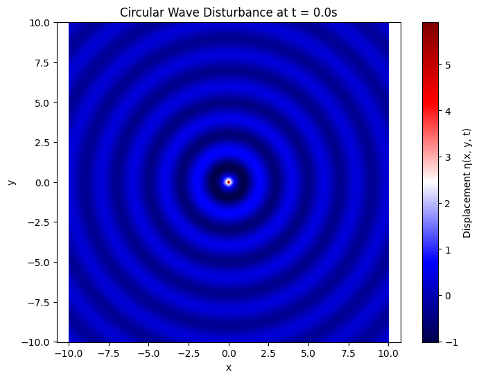

Here's a clean and complete **Markdown document** for **Task 1** involving the simulation of a **single circular wave disturbance** on a water surface. This includes **mathematical formulation**, **Python code**, and **visualization instructions**.

---

#  Circular Wave from a Point Source

## Problem Description

We model a **single circular water wave** radiating from a point source at location $(x_0, y_0)$. The wave disturbance on the water surface is given by the equation:

$$
\eta(x, y, t) = \frac{A}{\sqrt{r}} \cdot \cos(kr - \omega t + \phi)
$$

where:

* $\eta(x, y, t)$ is the water surface displacement at point $(x, y)$ and time $t$,
* $A$ is the wave amplitude,
* $r = \sqrt{(x - x_0)^2 + (y - y_0)^2}$ is the distance from the source,
* $k = \frac{2\pi}{\lambda}$ is the wave number,
* $\omega = 2\pi f$ is the angular frequency,
* $\phi$ is the initial phase (we'll assume 0 for simplicity).

---

##  Mathematical Components

Let us define:

* **Amplitude**: $A = 1.0$
* **Wavelength**: $\lambda = 2.0$
* **Frequency**: $f = 1.0$
* **Source location**: $(x_0, y_0) = (0, 0)$
* **Initial Phase**: $\phi = 0$

Then:

$$
k = \frac{2\pi}{\lambda}, \quad \omega = 2\pi f
$$

---

##  Python Simulation

---

##  Interpretation of Results

* The result is a **concentric ripple pattern** originating from the source.
* **Bright bands** (red) indicate **constructive interference** (peak displacement).
* **Dark bands** (blue) show **destructive interference** (valley).
* As $r$ increases, amplitude falls off as $1/\sqrt{r}$, mimicking real water wave attenuation.

---

##  Key Takeaways

* **Wavefronts** are circular and equidistant—this is expected from a point source.
* The **superposition principle** becomes relevant in future tasks with multiple sources.
* The effect of parameters like $\lambda$, $f$, and $t$ can be observed dynamically by varying values in the code.

---

