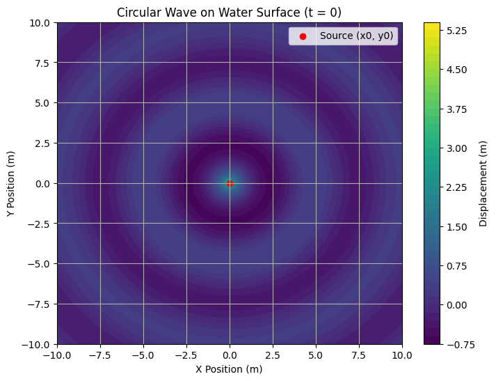

# PROBLEM 1

# Constants
A = 1               # Amplitude of the wave (meters)
lambda_wave = 5     # Wavelength (meters)
k = 2 * np.pi / lambda_wave  # Wave number, k = 2π/λ
omega = 2 * np.pi   # Angular frequency (rad/s), ω = 2πf
phi = 0             # Phase constant
x0, y0 = 0, 0       # Point source location at the origin (x0, y0)
f = 1               # Frequency (Hz)
t = 0               # Start at t = 0 (you can modify this for time-dependent simulation)

# Create a grid of points (x, y)
x = np.linspace(-10, 10, 400)  # X position range
y = np.linspace(-10, 10, 400)  # Y position range
X, Y = np.meshgrid(x, y)       # Create mesh grid

# Calculate the distance r from the point source at (x0, y0) to each point (x, y)
r = np.sqrt((X - x0)**2 + (Y - y0)**2)

# Formula: η(x, y, t) = (A / √r) * cos(k * r - ω * t + φ)
# Compute the wave displacement η(x, y, t) at each point for time = 0
eta = (A / np.sqrt(r)) * np.cos(k * r - omega * t + phi)

Explanation of the Code:
Constants:

Amplitude 
𝐴
A, Wavelength 
𝜆
λ, Wave number 
𝑘
k, Angular frequency 
𝜔
ω, and Phase constant 
𝜙
ϕ are all set at the beginning.

The source location is set at 
(
𝑥
0
,
𝑦
0
)
(x 
0
​
 ,y 
0
​
 ), and the frequency is 
𝑓
=
1
f=1 Hz.

Grid Creation:

We create a grid of points on the water surface using np.meshgrid to calculate the displacement 
𝜂
(
𝑥
,
𝑦
,
𝑡
)
η(x,y,t) at each grid point.

Wave Displacement Calculation:

The displacement 
𝜂
(
𝑥
,
𝑦
,
𝑡
)
η(x,y,t) at each point is calculated using the formula:

𝜂
(
𝑥
,
𝑦
,
𝑡
)
=
𝐴
𝑟
⋅
cos
⁡
(
𝑘
𝑟
−
𝜔
𝑡
+
𝜙
)
η(x,y,t)= 
r
​
 
A
​
 ⋅cos(kr−ωt+ϕ)
Where 
𝑟
r is the distance from the source to each point.

Plotting:

The contour plot visually represents the wave displacement, where the color map indicates the displacement values, with brighter areas corresponding to larger displacements (crests) and darker areas corresponding to smaller displacements (troughs).