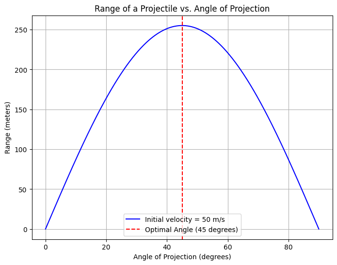

# Problem 1

## 1. Theoretical Foundation: Governing Equations of Projectile Motion

Projectile motion is a type of motion experienced by an object or particle that is thrown into the air, subject only to the force of gravity (neglecting air resistance). The object follows a curved path, and the goal is to analyze how the range (distance traveled horizontally) of a projectile depends on its initial velocity and the angle of projection.

### 1.1. **Fundamental Principles**

Projectile motion can be analyzed using Newton's second law, which gives the equations of motion for an object under constant acceleration. In the case of projectile motion, we assume:
- **Constant acceleration due to gravity**: The only force acting on the object (after it has been launched) is gravity, which causes a constant downward acceleration of $g = 9.8 \, \text{m/s}^2$ near the Earth's surface.
- **No air resistance**: We assume that air resistance is negligible, which simplifies the problem to one involving only vertical and horizontal motions.

### 1.2. **Equations of Motion**

For simplicity, we analyze the motion in two dimensions: **horizontal (x)** and **vertical (y)**.

#### 1.2.1. Horizontal Motion

The horizontal motion is governed by Newton’s first law, as there are no horizontal forces (since air resistance is neglected). Thus, the horizontal velocity remains constant.

\[
v_x = v_0 \cdot \cos(\theta)
\]

Where:
- $v_0$ is the initial velocity of the projectile,
- $\theta$ is the angle of projection,
- $v_x$ is the horizontal velocity.

The horizontal position $x(t)$ at time $t$ is given by:

\[
x(t) = v_0 \cdot \cos(\theta) \cdot t
\]

#### 1.2.2. Vertical Motion

The vertical motion is governed by the acceleration due to gravity. The equation for the vertical velocity $v_y$ at time $t$ is:

\[
v_y(t) = v_0 \cdot \sin(\theta) - g \cdot t
\]

Where:
- $v_0 \cdot \sin(\theta)$ is the initial vertical velocity,
- $g$ is the acceleration due to gravity ($9.8 \, \text{m/s}^2$).

The vertical position $y(t)$ is:

\[
y(t) = v_0 \cdot \sin(\theta) \cdot t - \frac{1}{2} g \cdot t^2
\]

#### 1.2.3. Time of Flight

The time of flight $T$ is the total time the projectile is in the air. This occurs when the vertical position $y(t)$ becomes zero (i.e., when the projectile hits the ground):

\[
0 = v_0 \cdot \sin(\theta) \cdot T - \frac{1}{2} g \cdot T^2
\]

Solving for $T$:

\[
T = \frac{2 v_0 \cdot \sin(\theta)}{g}
\]

#### 1.2.4. Range

The **range** $R$ is the horizontal distance the projectile travels before returning to the ground. This is found by substituting the time of flight $T$ into the horizontal displacement equation:

\[
R = v_0 \cdot \cos(\theta) \cdot T
\]

Substituting the expression for $T$:

\[
R = \frac{v_0^2 \cdot \sin(2\theta)}{g}
\]

This is the **general solution** for the range of a projectile, which shows how the range depends on the initial velocity $v_0$ and the angle of projection $\theta$. 

### 1.3. **Family of Solutions**

The equation for the range of a projectile, $R = \frac{v_0^2 \cdot \sin(2\theta)}{g}$, illustrates how variations in the initial conditions lead to a family of solutions.

- **Initial Velocity ($v_0$)**: The range is proportional to the square of the initial velocity. Doubling the initial velocity will quadruple the range.
  
- **Launch Angle ($\theta$)**: The sine function, $\sin(2\theta)$, causes the range to depend on the launch angle. The range is maximized when $\theta = 45^\circ$ because $\sin(90^\circ) = 1$. For angles less than $45^\circ$, the range decreases. Similarly, for angles greater than $45^\circ$, the range also decreases due to the symmetry of the sine function.

- **Gravitational Acceleration ($g$)**: The range is inversely proportional to $g$. In locations with lower gravitational acceleration (e.g., on the Moon), the range would be greater.

### 1.4. **Graphical Representation**

Let’s now create a graph to visualize how the range varies with the angle of projection for different initial velocities.

# #####################################
## Analysis of the Range

In this section, we will investigate how the **horizontal range** of a projectile depends on its **angle of projection**. We will also explore how changes in other parameters, such as the **initial velocity** and **gravitational acceleration**, influence the range relationship.

### 1. **Range as a Function of the Launch Angle**

The **horizontal range** of a projectile is the total horizontal distance the projectile travels before returning to the ground. The range $R$ is given by the equation:

$$
R = \frac{v_0^2 \cdot \sin(2\theta)}{g}
$$

Where:
- $R$ is the horizontal range,
- $v_0$ is the initial velocity,
- $\theta$ is the angle of projection,
- $g$ is the acceleration due to gravity.

The **sine function**, $\sin(2\theta)$, governs the dependence of the range on the launch angle. This is a key observation, as it suggests the following:

- **Symmetry**: The sine function is symmetric about $\theta = 45^\circ$. This means that the range is the same for launch angles $45^\circ$ and $45^\circ + \Delta\theta$, where $\Delta\theta$ is small. Therefore,

# #####################################
# #####################################
# #####################################