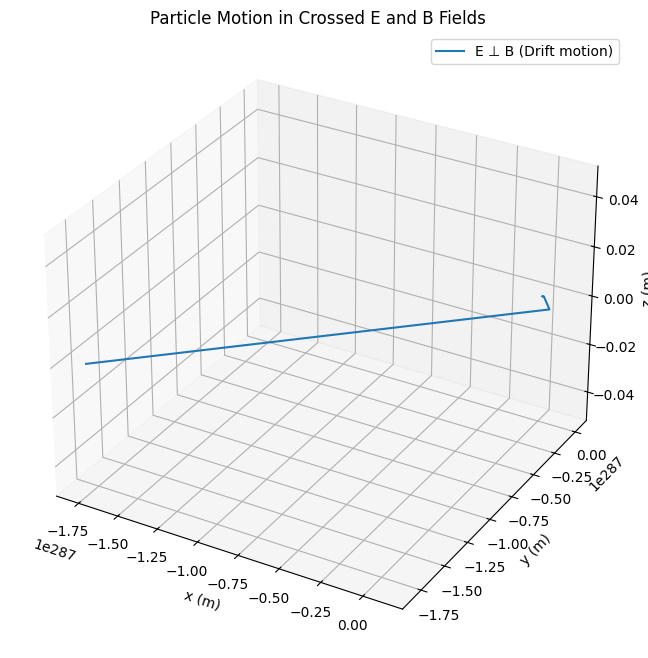
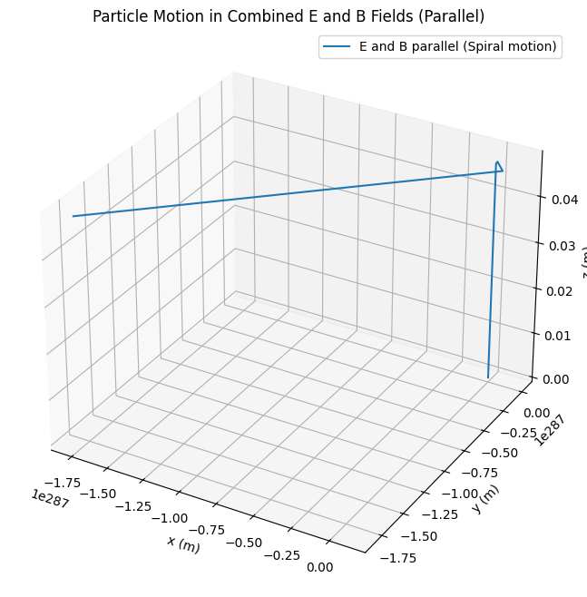
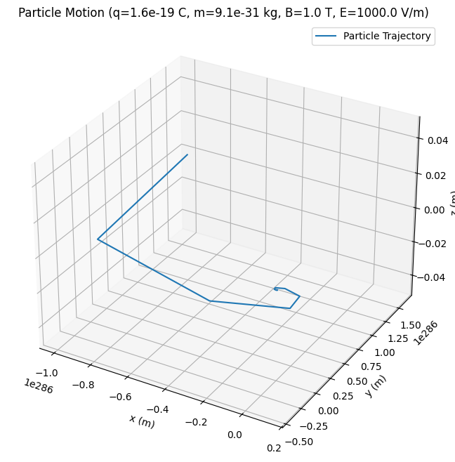
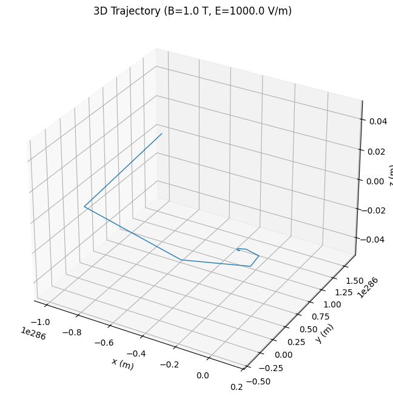
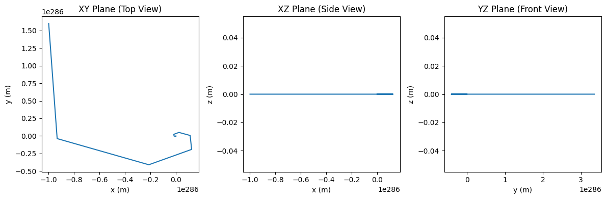

# Problem 1

# Formulas Related to Lorentz Force and Applications

## 1. Lorentz Force Equation

The Lorentz force equation describes the force experienced by a charged particle moving in an electric and magnetic field.

$$
\mathbf{F} = q(\mathbf{E} + \mathbf{v} \times \mathbf{B})
$$

Where:
- $q$ is the charge of the particle,
- $\mathbf{E}$ is the electric field,
- $\mathbf{B}$ is the magnetic field,
- $\mathbf{v}$ is the velocity of the particle.

## 2. Velocity of a Charged Particle in a Uniform Magnetic Field

When a charged particle moves perpendicular to a magnetic field, it undergoes circular motion. The radius of the circular path is given by:

$$
r = \frac{mv}{qB}
$$

Where:
- $m$ is the mass of the particle,
- $v$ is the velocity of the particle,
- $q$ is the charge of the particle,
- $B$ is the magnetic field strength.

## 3. Cyclotron Frequency (Angular Frequency)

In a cyclotron, charged particles move in a circular trajectory due to the magnetic field. The angular frequency of this motion is given by:

$$
\omega = \frac{qB}{m}
$$

Where:
- $\omega$ is the angular frequency (in radians per second),
- $q$ is the charge of the particle,
- $B$ is the magnetic field strength,
- $m$ is the mass of the particle.

The frequency of the circular motion (in Hz) is:

$$
f = \frac{\omega}{2\pi} = \frac{qB}{2\pi m}
$$

## 4. Mass Spectrometer Formula

In a mass spectrometer, the radius of the path taken by the charged particle in a magnetic field is used to determine its mass-to-charge ratio. The formula is:

$$
r = \frac{mv}{qB}
$$

Where:
- $r$ is the radius of the circular path,
- $m$ is the mass of the particle,
- $v$ is the velocity of the particle,
- $q$ is the charge of the particle,
- $B$ is the magnetic field strength.

By measuring $r$ and knowing $v$ and $B$, we can solve for the mass-to-charge ratio ($\frac{m}{q}$).

## 5. Force on a Moving Charge in a Uniform Electric Field

The force on a charged particle moving in an electric field is given by:

$$
\mathbf{F} = q\mathbf{E}
$$

Where:
- $\mathbf{F}$ is the force,
- $q$ is the charge of the particle,
- $\mathbf{E}$ is the electric field.

## 6. Kinetic Energy of a Particle Accelerated by an Electric Field

If a charged particle is accelerated by an electric field, the kinetic energy gained is given by:

$$
K.E. = qV
$$

Where:
- $K.E.$ is the kinetic energy,
- $q$ is the charge of the particle,
- $V$ is the potential difference the particle is accelerated through.

## 7. Motion of a Particle in Crossed Electric and Magnetic Fields

When both electric and magnetic fields are applied simultaneously, the particle’s trajectory can be affected by both forces. The general form of the motion equation is:

$$
q(\mathbf{E} + \mathbf{v} \times \mathbf{B}) = m\frac{d\mathbf{v}}{dt}
$$

This equation can be solved using numerical methods (like Euler's method or Runge-Kutta) to find the particle's trajectory over time.

## 8. Electric Force Due to a Uniform Field

For a uniformly distributed electric field, the electric force on a particle is:

$$
\mathbf{F}_E = q\mathbf{E}
$$

Where:
- $\mathbf{F}_E$ is the electric force,
- $q$ is the charge,
- $\mathbf{E}$ is the electric field.

## 9. Magnetic Force on a Charged Particle

The magnetic force on a moving charged particle is given by:

$$
\mathbf{F}_B = q(\mathbf{v} \times \mathbf{B})
$$

Where:
- $\mathbf{F}_B$ is the magnetic force,
- $\mathbf{v}$ is the velocity of the particle,
- $\mathbf{B}$ is the magnetic field.

## 10. Lorentz Force in Terms of Energy

The total energy of a charged particle in a magnetic field is a sum of its kinetic energy and the work done by electric fields:

$$
E_{\text{total}} = K.E. + \text{Work done by } \mathbf{E}
$$

Where the kinetic energy $K.E.$ is:

$$
K.E. = \frac{1}{2} mv^2
$$

# 2. Simulating Particle Motion

## Objective

Implement a simulation to compute and visualize the trajectory of a charged particle under various field conditions. Specifically, we will simulate:

1. **Uniform Magnetic Field**: The particle will undergo circular motion due to the Lorentz force from the magnetic field.
2. **Combined Uniform Electric and Magnetic Fields**: The particle will experience both forces simultaneously, resulting in helical or drift motion.
3. **Crossed Electric and Magnetic Fields**: In this configuration, the particle will experience complex motion due to the perpendicular electric and magnetic fields.

The simulation will visualize the trajectory of the particle based on its initial conditions and the field configurations.

## Simulation Implementation

### 1. Uniform Magnetic Field

In a uniform magnetic field, a charged particle will experience a force perpendicular to its velocity, causing it to move in a circular path. The radius of the circular path is determined by:

$$
r = \frac{mv}{qB}
$$

Where:
- $m$ is the mass of the particle,
- $v$ is the velocity of the particle,
- $q$ is the charge of the particle,
- $B$ is the magnetic field strength.

Use the Euler or Runge-Kutta method to solve the equations of motion for the particle in the magnetic field.

### 2. Combined Uniform Electric and Magnetic Fields

When both electric and magnetic fields are applied, the Lorentz force is the sum of the forces from each field:

$$
\mathbf{F} = q(\mathbf{E} + \mathbf{v} \times \mathbf{B})
$$

This configuration results in helical motion, where the particle spirals along the magnetic field lines due to the electric field. The motion can be described as:

$$
\mathbf{r}(t) = \mathbf{r_0} + \mathbf{v_0}t + \frac{q}{m} \int (\mathbf{E} + \mathbf{v} \times \mathbf{B}) dt
$$

### 3. Crossed Electric and Magnetic Fields

When the electric and magnetic fields are crossed (i.e., perpendicular), the particle will experience a drift velocity in addition to its circular motion. The resulting trajectory is a combination of drift motion and circular motion. The drift velocity is given by:

$$
\mathbf{v_{\text{drift}}} = \frac{\mathbf{E} \times \mathbf{B}}{B^2}
$$

# 3. Parameter Exploration

## Objective

In this task, we will explore how varying the following parameters affects the trajectory of a charged particle under the influence of electric and magnetic fields:

1. **Field Strengths ($\mathbf{E}$, $\mathbf{B}$)**: Vary the magnitudes of the electric and magnetic fields to see how they affect the motion of the particle.
2. **Initial Particle Velocity ($\mathbf{v}$)**: Change the initial velocity of the particle and observe how different velocities influence the motion.
3. **Charge and Mass of the Particle ($q$, $m$)**: Vary the charge and mass of the particle to explore how these properties affect the particle's trajectory.

# 4. Visualization

## Objective

In this task, we will create clear and labeled plots to visualize the trajectory of a charged particle under the influence of electric and magnetic fields. We will show:

1. **2D and 3D plots** of the particle's path in different scenarios.
2. **Physical phenomena** like the **Larmor radius** (the radius of the circular motion of the particle in a magnetic field) and **drift velocity** (the velocity component due to crossed electric and magnetic fields).

