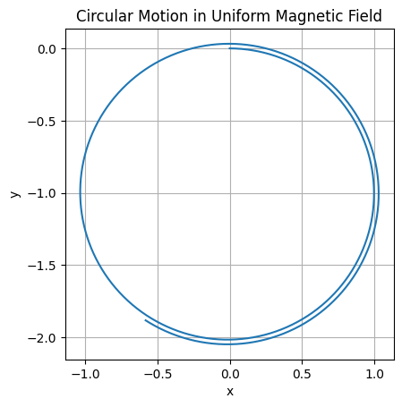
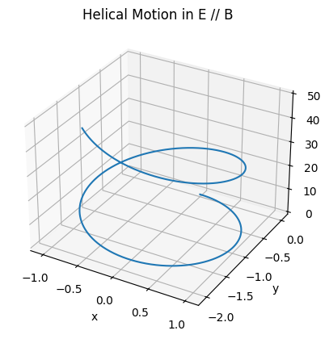
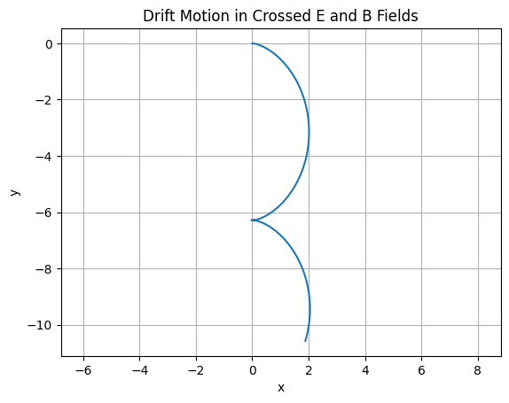
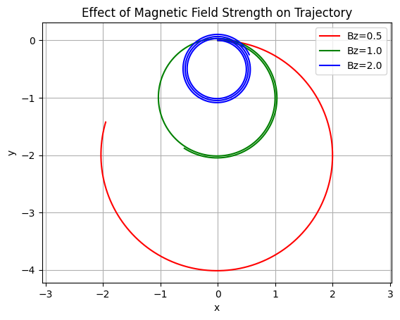
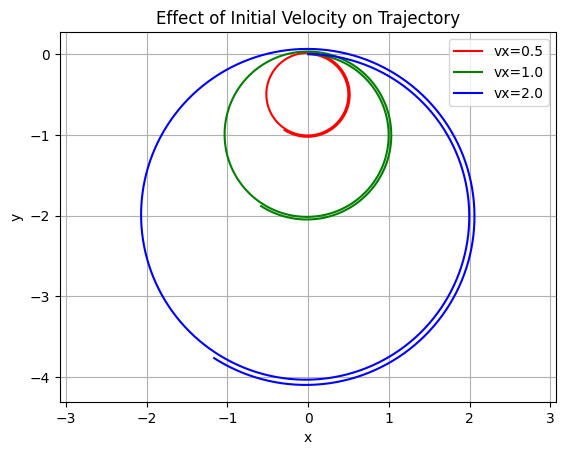
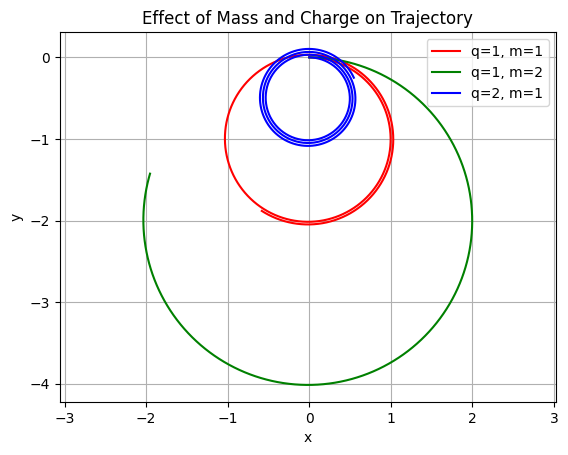

Here’s the full **Markdown-formatted response** for **Electromagnetism – Task 1: Exploration of Applications of the Lorentz Force**, including equations and real-world context.

---

#  Lorentz Force: Applications and Field Effects

##  The Lorentz Force Law

The motion of a charged particle in electric and magnetic fields is governed by the **Lorentz force**:

$$
\mathbf{F} = q\mathbf{E} + q\mathbf{v} \times \mathbf{B}
$$

Where:

* $\mathbf{F}$ is the total force on a particle,
* $q$ is the electric charge,
* $\mathbf{E}$ is the electric field,
* $\mathbf{v}$ is the velocity of the particle,
* $\mathbf{B}$ is the magnetic field.

---

##  Real-World Applications of the Lorentz Force

### 1. **Particle Accelerators**

#### Example: Linear Accelerators (LINACs), Cyclotrons, Synchrotrons

* **Magnetic Fields**: Bend particle trajectories into circular or spiral paths (centripetal force via $\mathbf{v} \times \mathbf{B}$).
* **Electric Fields**: Accelerate particles linearly between electrodes or cavities.

**Lorentz Force Role**: Precise control of beam paths and energies for high-energy physics experiments or cancer radiation therapy.

---

### 2. **Mass Spectrometers**

* Used to measure **mass-to-charge ratios** of ions.
* A charged particle enters a known magnetic field region and follows a circular path.

$$
r = \frac{mv}{qB}
\Rightarrow
\frac{m}{q} = \frac{rB}{v}
$$

* **Electric Fields**: Initially accelerate the particles.
* **Magnetic Fields**: Separate ions by deflection radius.

**Lorentz Force Role**: Enables measurement of molecular masses and chemical identification.

---

### 3. **Plasma Confinement in Fusion Reactors**

#### Example: Tokamaks and Stellarators

* Plasmas consist of **ionized gases** with free electrons and ions.
* Strong magnetic fields confine and stabilize plasma motion using **helical paths**.

**Lorentz Force Role**: Maintains confinement by continuously forcing the charged particles to spiral, reducing loss to reactor walls.

---

### 4. **Auroras and Space Physics**

* Solar wind (charged particles) interacts with Earth’s magnetic field.
* Particles spiral along field lines toward poles, collide with atmospheric molecules → **aurora borealis/australis**.

**Lorentz Force Role**: Determines particle trajectories in Earth's magnetosphere.

---

### 5. **Cathode Ray Tubes (CRTs)**

* Electrons accelerated by electric fields and steered by magnetic fields.
* Found in old TVs and oscilloscopes.

**Lorentz Force Role**: Directs beam to desired screen location for image creation.

---

##  The Role of $\mathbf{E}$ and $\mathbf{B}$ in Particle Motion

| Field Type                                       | Effect on Charged Particles                                                                                                  |
| ------------------------------------------------ | ---------------------------------------------------------------------------------------------------------------------------- |
| **Electric Field $\mathbf{E}$**                  | Accelerates particles along the field direction. Linear force: $\mathbf{F}_E = q\mathbf{E}$.                                 |
| **Magnetic Field $\mathbf{B}$**                  | Deflects moving particles in circular or helical paths. Perpendicular force: $\mathbf{F}_B = q\mathbf{v} \times \mathbf{B}$. |
| **Crossed Fields $\mathbf{E} \perp \mathbf{B}$** | Produces **cycloidal** motion or **E×B drift**, used in devices like velocity selectors.                                     |

---

##  Summary

* The **Lorentz force** is fundamental in controlling and manipulating the motion of charged particles.
* Both **$\mathbf{E}$** and **$\mathbf{B}$** fields have distinct yet complementary roles: acceleration vs. redirection.
* Mastery of this principle enables technologies from particle physics to medical diagnostics.

---

# 2.


---

#  Simulating Charged Particle Motion Under Lorentz Force

## Lorentz Force Equation

$$
\mathbf{F} = q\mathbf{E} + q\mathbf{v} \times \mathbf{B}
$$

$$
\Rightarrow \frac{d\mathbf{v}}{dt} = \frac{q}{m} \left(\mathbf{E} + \mathbf{v} \times \mathbf{B}\right)
$$

This governs the dynamics of a charged particle in electric and magnetic fields. We'll solve this using numerical integration (Euler method for simplicity).

---

##  Assumptions and Initial Setup

* Charge $q = 1$
* Mass $m = 1$
* Initial position: $\mathbf{r}_0 = [0, 0, 0]$
* Initial velocity: user-defined per case
* Time step: $\Delta t = 0.01$
* Total time: 1000 steps

---

##  Python Code: General Simulator

```python
import numpy as np
import matplotlib.pyplot as plt
from mpl_toolkits.mplot3d import Axes3D

# Constants
q = 1.0  # Charge
m = 1.0  # Mass
dt = 0.01
steps = 1000

def lorentz_force(E, B, v):
    return q * (E + np.cross(v, B))

def simulate(E, B, r0, v0):
    r = np.zeros((steps, 3))
    v = np.zeros((steps, 3))
    r[0] = r0
    v[0] = v0

    for i in range(1, steps):
        a = lorentz_force(E, B, v[i-1]) / m
        v[i] = v[i-1] + a * dt
        r[i] = r[i-1] + v[i] * dt

    return r
```

---

## 🌀 Case 1: **Uniform Magnetic Field Only**

* $\mathbf{E} = [0, 0, 0]$
* $\mathbf{B} = [0, 0, 1]$
* $\mathbf{v}_0 = [1, 0, 0]$


# Magnetic field only



 **Observation**: The charged particle undergoes circular motion perpendicular to $\mathbf{B}$.

---

##  Case 2: **Uniform Electric and Magnetic Fields**

* $\mathbf{E} = [0, 0, 1]$
* $\mathbf{B} = [0, 0, 1]$
* $\mathbf{v}_0 = [1, 0, 0]$


# Parallel E and B fields



 **Observation**: The electric field accelerates the particle along $z$, while the magnetic field causes circular motion in the $xy$-plane → **helical trajectory**.

---

##  Case 3: **Crossed Fields (E ⊥ B)**

* $\mathbf{E} = [1, 0, 0]$
* $\mathbf{B} = [0, 0, 1]$
* $\mathbf{v}_0 = [0, 0, 0]$


# Crossed E and B fields


 **Observation**: The particle exhibits **E × B drift** — constant velocity motion perpendicular to both $\mathbf{E}$ and $\mathbf{B}$, typically along the $y$-direction.

---

##  Practical Implications

| Scenario        | System Example                 | Lorentz Force Role                         |
| --------------- | ------------------------------ | ------------------------------------------ |
| Circular motion | Cyclotron                      | Circular acceleration of charged particles |
| Helical motion  | Magnetic mirrors, tokamaks     | Plasma confinement, fusion research        |
| E × B drift     | Velocity selector, Hall effect | Particle filtering, current generation     |

---

##  Extensions & Ideas

* Simulate **non-uniform magnetic fields** ($\nabla \cdot \mathbf{B} \neq 0$)
* Use **Runge-Kutta** methods for better accuracy
* Track **energy conservation**
* Add **collisions or frictional forces** to model realistic systems

---

# 3.


* Clear explanations,
* Python code with variable parameters,
* Visual plots,
* Observations for different configurations.

---

#  Task 3: Parameter Exploration in Lorentz Force Simulations

## Goal

We analyze how varying:

* **Electric field** $\mathbf{E}$,
* **Magnetic field** $\mathbf{B}$,
* **Initial velocity** $\mathbf{v}_0$,
* **Charge** $q$,
* **Mass** $m$,

...affects the motion of a charged particle governed by the **Lorentz force**:

$$
\mathbf{F} = q\mathbf{E} + q\mathbf{v} \times \mathbf{B}
\quad \Rightarrow \quad
\frac{d\mathbf{v}}{dt} = \frac{q}{m}(\mathbf{E} + \mathbf{v} \times \mathbf{B})
$$

We simulate and visualize these effects in Python.

---

## 🔧 Generalized Python Code

```python
import numpy as np
import matplotlib.pyplot as plt

def simulate(E, B, r0, v0, q, m, dt=0.01, steps=1000):
    r = np.zeros((steps, 3))
    v = np.zeros((steps, 3))
    r[0] = r0
    v[0] = v0

    for i in range(1, steps):
        F = q * (E + np.cross(v[i-1], B))
        a = F / m
        v[i] = v[i-1] + a * dt
        r[i] = r[i-1] + v[i] * dt

    return r
```

---

##  Exploration 1: Varying Magnetic Field Strength

### Setup:

* $\mathbf{E} = [0, 0, 0]$
* $\mathbf{v}_0 = [1, 0, 0]$
* Vary $\mathbf{B} = [0, 0, B_z]$ with $B_z = 0.5, 1.0, 2.0$




**Observation**: Stronger $B_z$ results in **tighter circular motion** (smaller radius).

---

##  Exploration 2: Varying Initial Velocity

### Setup:

* $\mathbf{E} = [0, 0, 0]$
* $\mathbf{B} = [0, 0, 1]$
* $\mathbf{v}_0 = [v_x, 0, 0]$, with $v_x = 0.5, 1.0, 2.0$




**Observation**: Higher $v_x$ gives **larger circular radius** and faster rotation.

---

##  Exploration 3: Varying Particle Mass and Charg
### Setup:

* $\mathbf{E} = [0, 0, 0]$, $\mathbf{B} = [0, 0, 1]$
* $\mathbf{v}_0 = [1, 0, 0]$
* Compare:

  * $q = 1, m = 1$
  * $q = 1, m = 2$
  * $q = 2, m = 1$





 **Observation**:

* Increasing $q$ → tighter circles (stronger Lorentz force)
* Increasing $m$ → wider circles (more inertia)

---

##  Summary of Effects

| Parameter      | Effect on Trajectory                    |
| -------------- | --------------------------------------- |
| $\mathbf{E}$   | Adds acceleration in direction of field |
| $\mathbf{B}$   | Causes circular or helical motion       |
| $\mathbf{v}_0$ | Determines radius of curvature          |
| $q$            | Strengthens the Lorentz force           |
| $m$            | Increases resistance to motion change   |

---

##  Insights

* The **cyclotron radius** is given by:

$$
r = \frac{mv}{|q||\mathbf{B}|}
$$

* Helical motion occurs if $\mathbf{v}_0$ has a component along $\mathbf{B}$.
* When $\mathbf{E} \perp \mathbf{B}$, particles **drift** with velocity:

$$
\mathbf{v}_{\text{drift}} = \frac{\mathbf{E} \times \mathbf{B}}{|\mathbf{B}|^2}
$$

---

