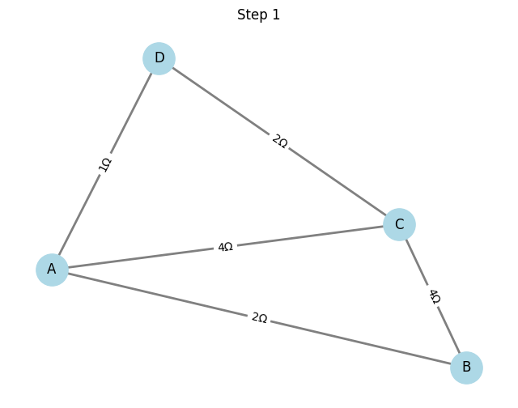
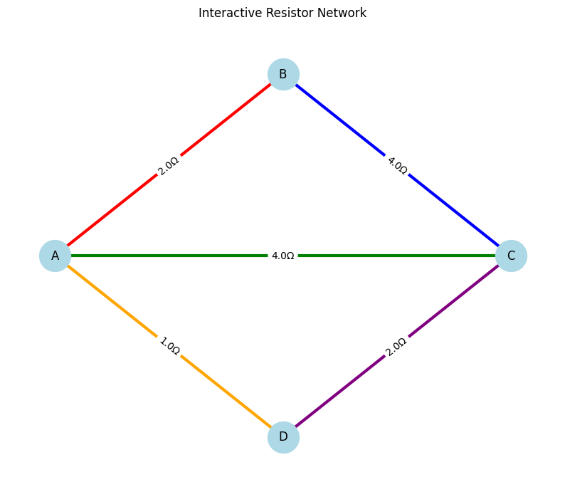
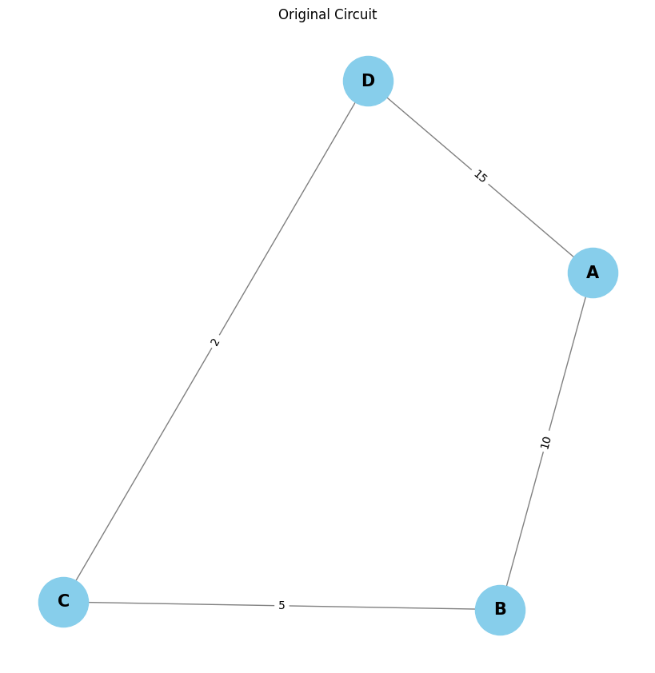

# Problem 1

# Algorithm for Calculating Equivalent Resistance Using Graph Theory

## Overview

To calculate the equivalent resistance of an electrical circuit using graph theory, we represent the circuit as a graph. The nodes in the graph represent junctions (or circuit nodes), and the edges represent resistors with weights equal to their resistance values. The algorithm simplifies the circuit step by step by reducing series and parallel resistors, ultimately calculating the equivalent resistance between two nodes.

## Algorithm Steps

### 1. Graph Representation
The circuit is represented as an undirected graph:
- **Nodes**: Represent junctions or components in the circuit.
- **Edges**: Represent resistors with resistance values assigned as weights.

The graph is constructed as follows:
$$
G = (V, E)
$$
Where:
- $V$ is the set of vertices (nodes),
- $E$ is the set of edges (resistors) with weights representing resistance values.

### 2. Identify Linear Chains for Series Reduction
In a series connection, resistors are connected end to end. The equivalent resistance of resistors in series is the sum of their resistances. To identify series connections:
- Traverse the graph using **Depth-First Search (DFS)** or **Breadth-First Search (BFS)**.
- If two resistors are connected linearly (i.e., one node connects them), reduce their resistance by summing the individual resistances.

For two resistors in series:
$$
R_{\text{eq}} = R_1 + R_2
$$
Where:
- $R_1$ and $R_2$ are the individual resistances.

### 3. Identify Cycles for Parallel Reduction
In parallel connections, resistors share the same two nodes. The equivalent resistance of resistors in parallel is given by:
$$
\frac{1}{R_{\text{eq}}} = \frac{1}{R_1} + \frac{1}{R_2}
$$
For $n$ resistors in parallel:
$$
\frac{1}{R_{\text{eq}}} = \sum_{i=1}^n \frac{1}{R_i}
$$

To detect parallel connections:
- Identify cycles in the graph where two or more resistors share the same pair of nodes.
- Use DFS to detect cycles and reduce the resistances accordingly by using the parallel resistance formula.

### 4. Iterative Simplification
- Start from any node and traverse the graph.
- In each iteration, detect series and parallel connections and reduce the resistances.
- Simplify the graph step by step until only one equivalent resistance remains between the two nodes.

### 5. Termination
The algorithm terminates when the graph has been reduced to a single equivalent resistance between the two terminal nodes of the circuit.

# Algorithm for Calculating Equivalent Resistance Using Graph Theory

## Overview

To calculate the equivalent resistance of an electrical circuit using graph theory, we represent the circuit as a graph. The nodes in the graph represent junctions (or circuit nodes), and the edges represent resistors with weights equal to their resistance values. The algorithm simplifies the circuit step by step by reducing series and parallel resistors, ultimately calculating the equivalent resistance between two nodes.

## Algorithm Steps

### 1. Graph Representation
The circuit is represented as an undirected graph:
- **Nodes**: Represent junctions or components in the circuit.
- **Edges**: Represent resistors with resistance values assigned as weights.

The graph is constructed as follows:
$$
G = (V, E)
$$
Where:
- $V$ is the set of vertices (nodes),
- $E$ is the set of edges (resistors) with weights representing resistance values.

### 2. Identify Linear Chains for Series Reduction
In a series connection, resistors are connected end to end. The equivalent resistance of resistors in series is the sum of their resistances. To identify series connections:
- Traverse the graph using **Depth-First Search (DFS)** or **Breadth-First Search (BFS)**.
- If two resistors are connected linearly (i.e., one node connects them), reduce their resistance by summing the individual resistances.

For two resistors in series:
$$
R_{\text{eq}} = R_1 + R_2
$$
Where:
- $R_1$ and $R_2$ are the individual resistances.

### 3. Identify Cycles for Parallel Reduction
In parallel connections, resistors share the same two nodes. The equivalent resistance of resistors in parallel is given by:
$$
\frac{1}{R_{\text{eq}}} = \frac{1}{R_1} + \frac{1}{R_2}
$$
For $n$ resistors in parallel:
$$
\frac{1}{R_{\text{eq}}} = \sum_{i=1}^n \frac{1}{R_i}
$$

To detect parallel connections:
- Identify cycles in the graph where two or more resistors share the same pair of nodes.
- Use DFS to detect cycles and reduce the resistances accordingly by using the parallel resistance formula.

### 4. Iterative Simplification
- Start from any node and traverse the graph.
- In each iteration, detect series and parallel connections and reduce the resistances.
- Simplify the graph step by step until only one equivalent resistance remains between the two nodes.

### 5. Termination
The algorithm terminates when the graph has been reduced to a single equivalent resistance between the two terminal nodes of the circuit.

# Pseudocode for Identifying Series and Parallel Connections and Iterative Reduction (Including Nested Combinations)

## Overview

The algorithm for calculating the equivalent resistance using graph theory iteratively identifies and reduces series and parallel connections in a circuit. When resistors are combined in series or parallel, their resistances are reduced, simplifying the circuit. This can lead to new connections being formed, which also need to be simplified. This is known as **nested combinations**, where a simple reduction can reveal further series or parallel connections in the graph.

## Key Concepts

- **Series Connection**: Two resistors are in series if they are connected end to end. The total resistance is the sum of individual resistances:
  $$
  R_{\text{eq}} = R_1 + R_2
  $$

- **Parallel Connection**: Two resistors are in parallel if they are connected between the same two nodes. The total resistance is given by:
  $$
  \frac{1}{R_{\text{eq}}} = \frac{1}{R_1} + \frac{1}{R_2}
  $$

- **Nested Combinations**: When reducing a part of the circuit, a new series or parallel combination may emerge from the simplified graph. These new combinations must also be reduced until the entire circuit is simplified to a single equivalent resistance.

# Option 2: Advanced Task – Full Implementation

## Overview

In this task, you will implement an algorithm to calculate the **equivalent resistance** of a circuit, represented as a graph. The graph consists of **nodes** (junctions) and **edges** (resistors). The goal is to simplify the graph iteratively by combining resistors in **series** and **parallel** until a single equivalent resistance remains between two nodes.

### Key Requirements

1. **Input**: The algorithm should accept a **circuit graph** as input.
2. **Handling Configurations**: The implementation must handle **arbitrary resistor configurations**, including **nested series** and **parallel connections**.
3. **Output**: The algorithm should output the **final equivalent resistance** after all simplifications.

### Task Breakdown

#### 1. Implement the algorithm to calculate equivalent resistance using graph theory.
   - The circuit is represented as a **graph**: nodes are circuit junctions, and edges represent resistors.
   - The algorithm will iterate over the graph, identifying and reducing **series** and **parallel** connections.
   - Series resistances are added, and parallel resistances are calculated as:
     $$
     \frac{1}{R_{\text{eq}}} = \sum_{i=1}^{n} \frac{1}{R_i}
     $$

#### 2. Handle nested configurations.
   - The algorithm should be able to handle situations where simplifying one part of the circuit reveals more series or parallel combinations that need to be reduced further.
   - For series combinations:
     $$
     R_{\text{eq}} = R_1 + R_2
     $$

#### 3. Testing the implementation with examples:
   - **Simple Series and Parallel Combinations**: Example where all resistors are either in series or parallel.
   - **Nested Configurations**: Example where series and parallel resistors are interspersed, requiring multiple iterations to simplify.
   - **Complex Graphs with Multiple Cycles**: A more complex example with multiple resistors and cycles.

### Formulas Recap

1. **Series Connection**:
   - The equivalent resistance of two resistors in series is the sum of their individual resistances:
     $$
     R_{\text{eq}} = R_1 + R_2
     $$

2. **Parallel Connection**:
   - The equivalent resistance of two resistors in parallel is given by:
     $$
     \frac{1}{R_{\text{eq}}} = \frac{1}{R_1} + \frac{1}{R_2}
     $$

   - For $n$ resistors in parallel:
     $$
     \frac{1}{R_{\text{eq}}} = \sum_{i=1}^{n} \frac{1}{R_i}
     $$

3. **Nested Configurations**:
   - Simplify the circuit by identifying and reducing series and parallel combinations iteratively until only one equivalent resistance remains.

---

### Steps to Implement:

1. **Graph Representation**: Represent the circuit as a graph with nodes (junctions) and edges (resistors with their resistance values).
   
2. **Series and Parallel Reduction**: 
   - Implement functions to detect series and parallel connections and reduce them.
   - For series: Add resistances.
   - For parallel: Use the parallel resistance formula.

3. **Iterative Simplification**: 
   - Repeatedly simplify the graph by combining resistors until only one equivalent resistance remains.

4. **Final Output**: Output the final equivalent resistance between the two terminal nodes.

---

