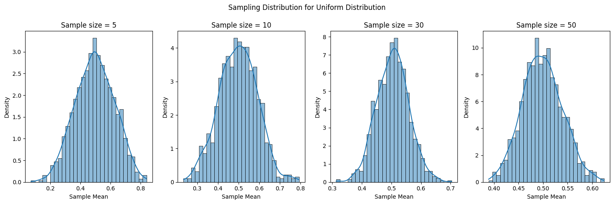
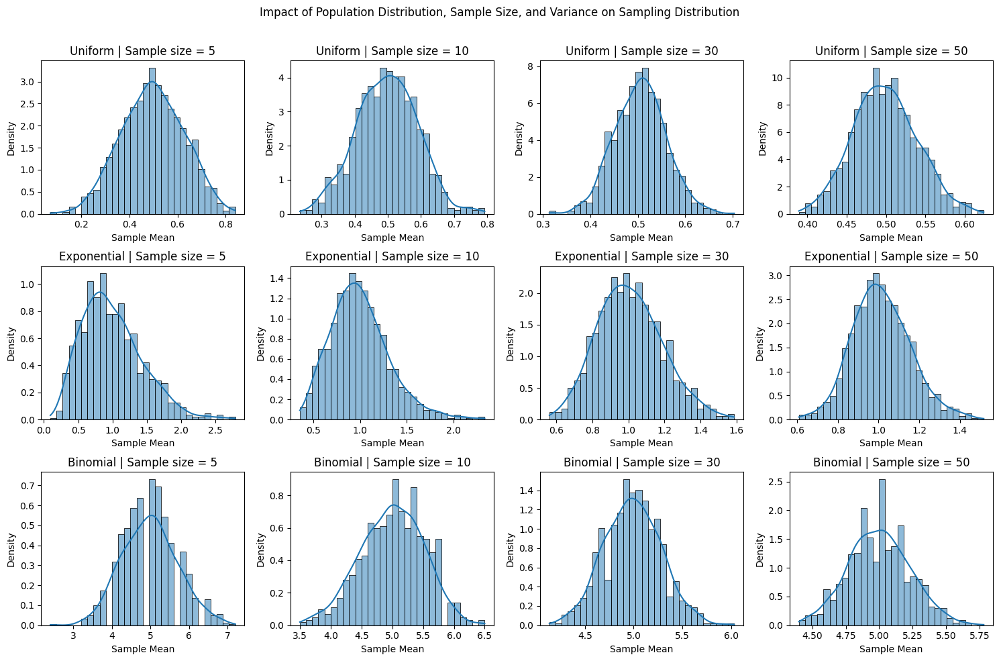

# Simulating Sampling Distributions

## Overview
In this task, we will simulate sampling distributions from various population distributions. The goal is to observe how the sampling distribution of the sample mean behaves as the sample size increases, which illustrates the Central Limit Theorem (CLT). We will work with three types of population distributions:

1. **Uniform distribution**
2. **Exponential distribution**
3. **Binomial distribution**

## Setup

The steps are as follows:

1. **Generate population data** from each distribution.
2. **Take random samples** from the population and compute the sample mean.
3. **Repeat the sampling process** many times to build the sampling distribution of the mean.
4. **Visualize the results** using histograms and probability density functions (PDFs).

# TASK 2
# Sampling and Visualization

## Overview
In this task, we will randomly sample data from a population and calculate the sample mean for different sample sizes (e.g., 5, 10, 30, 50). By repeating this process many times, we will create a sampling distribution of the sample mean. We will then plot histograms of the sample means for each sample size to observe how the distribution of the sample mean converges to a normal distribution as the sample size increases, demonstrating the Central Limit Theorem (CLT).

## Steps

1. **Sample Data**: Randomly sample from the population for different sample sizes.
2. **Calculate Sample Mean**: For each sample, calculate the mean.
3. **Repeat the Process**: Repeat the sampling process multiple times to build the sampling distribution.
4. **Visualization**: Plot histograms for each sample size and observe the convergence to normality.

# TASK 3
# Parameter Exploration

## Overview
In this task, we will explore how the shape of the original population distribution and the sample size influence the rate of convergence to normality. We will also investigate the impact of the population’s variance on the spread of the sampling distribution. The goal is to observe how different population distributions (with varying shapes) and sample sizes affect the sampling distribution of the sample mean.

### Key Concepts to Explore:
1. **Shape of the original distribution**: We will use three different population distributions—Uniform, Exponential, and Binomial—to explore how their shapes influence the rate at which the sampling distribution converges to normality.
2. **Sample size**: We will analyze how the sample size influences the rate of convergence to a normal distribution.
3. **Population variance**: The variance of the population will influence the spread of the sampling distribution of the sample mean. Larger variances lead to wider distributions for the sample means.

## Graph
