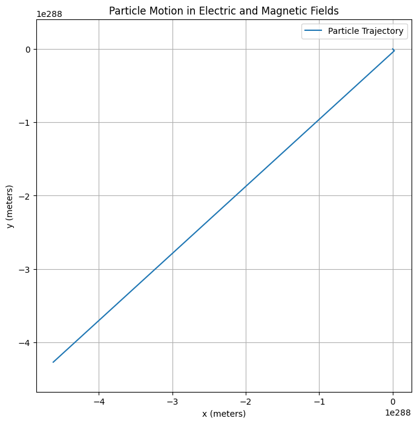

# Simulating Sampling Distributions

## Overview
In this task, we will simulate sampling distributions from various population distributions. The goal is to observe how the sampling distribution of the sample mean behaves as the sample size increases, which illustrates the Central Limit Theorem (CLT). We will work with three types of population distributions:

1. **Uniform distribution**
2. **Exponential distribution**
3. **Binomial distribution**

## Setup

The steps are as follows:

1. **Generate population data** from each distribution.
2. **Take random samples** from the population and compute the sample mean.
3. **Repeat the sampling process** many times to build the sampling distribution of the mean.
4. **Visualize the results** using histograms and probability density functions (PDFs).

## Code

